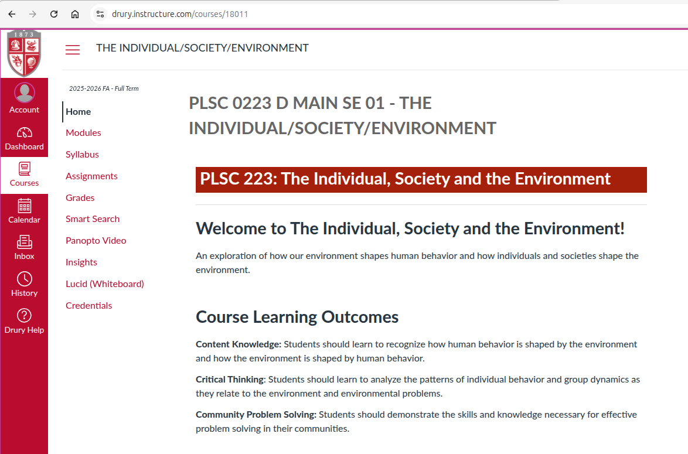
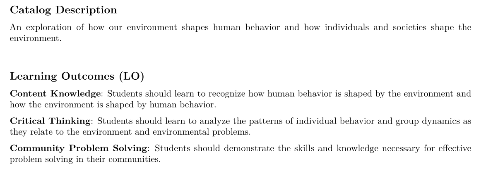
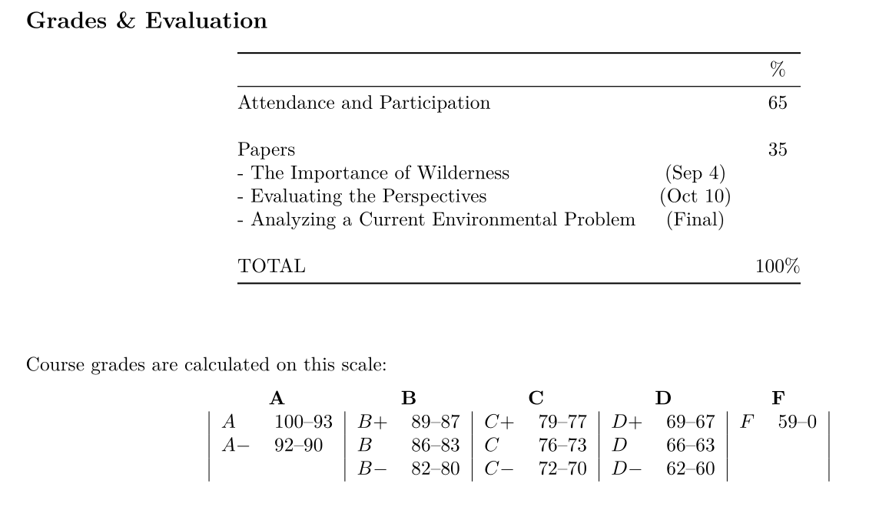
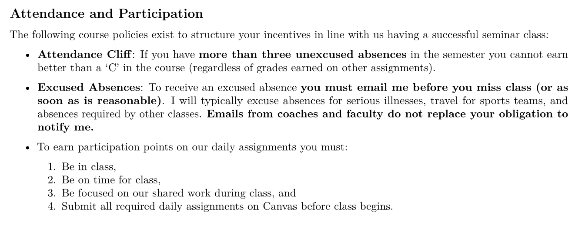
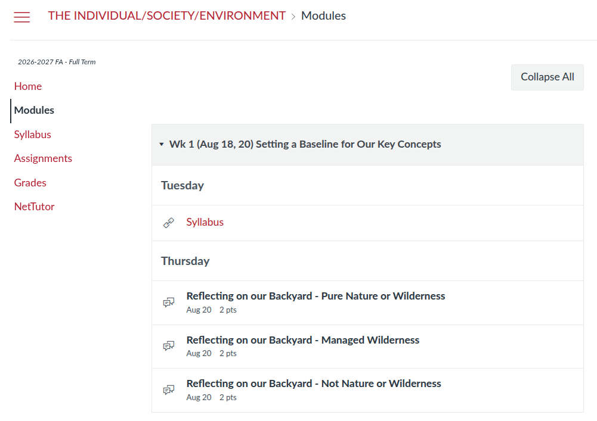

## Today's Agenda {background-image="Images/background-forest_v3.png" .center}

```{r}
library(tidyverse)
library(readxl)
library(kableExtra)
```

<br>

::: {.r-fit-text}

**PLSC 223**

- **The Individual, Society and the Environment**

:::

<br>

<br>

::: r-stack
Justin Leinaweaver (Fall 2026)
:::

::: notes
Prep for Class

1. Update attendance list

<br>

Welcome to The Individual, Society and the Environment

- I'm Dr. Leinaweaver

- **Is everybody in the right place?**

<br>

**SLIDE**: Warm-up current events

:::


## Current Events Check-in {background-image="Images/background-forest_v3.png" .center}

<br>

### What's going on in the world of environmental problems or policy?

::: {.fragment}
1. What happened?

2. Why should we care about it?

3. Why is this an "environmental" issue?
:::

::: notes

Everybody pull out your phone / tablet / laptop and go find me a current event that we would consider "environmental" in some way

- Go!

<br>

**Everybody got something?**

- Ok, get ready to report back to us on what you found using these three prompts

- **REVEAL**

1. What is the specific thing being reported? e.g. what happened?

2. Why should we care about it?

3. Why is this an environmental issue? Define the concept

<br>

**Questions on the assignment?**

- Go!

<br>

*PRESENT and DISCUSS each*

<br>

**SLIDE**: Introductions

:::


## Introductions {background-image="Images/background-forest_v3.png" .center}

::: {.r-fit-text}
1. Name

2. Year in school

3. Major

4. PLSC, Certificate or Explorations?
:::

::: notes

This class is almost always a quirky collection of backgrounds and interests!

- Some of you are here for the environment Fusion certificate, 

- Some are here to meet a Fusion Exploration requirement, and

- Some are poli sci or environmental biology majors

<br>

So, let's go around the room for introductions (and attendance).

<br>

I'll go first.

1. I'm Dr. Justin Leinaweaver.

2. FSU undergrad, masters in IR at UCD and PhD at Trinity.
    - My fourteenth year at Drury

3. I'm a political scientist
    - Research interests: international policymaking, environmental politics and bargaining / negotiations.
  
4. I'm the director of the Solving Environmental Problems certificate

<br>

**Your turn**

<br>

**SLIDE**: For those of you not here for the certificate, let me quickly pitch you on it

:::


## {background-image="Images/background-forest_v3.png" .center}

::: {.r-fit-text}
**Designing Solutions for Environmental Problems**
:::

<br>

::: {.r-fit-text}
**Required Courses**

- PLSC 223 The Individual, Society and the Environment

- BIOL 163 Science of the Environment

- ECON 225 Introduction to Environmental Economics

- PLSC 323 Issues in Environmental Policy

:::

::: notes

So, this class is the intro for the "Designing Solutions for Environmental Problems" Fusion Certificate.

- This is a "professional" certificate means to help you quickly develop the background and skills needed to make a concrete difference in your community

<br>

Our argument to you is that successfully solving environmental problems requires an understanding of:

- the community that faces the problem,

- the science of the problem,

- the economics of the problem, and

- the tools of good policy design.

<br>

If anybody has questions on the certificate I'm happy to meet and discuss.

<br>

**SLIDE**: Let's go to Canvas!
:::


## {background-image="Images/background-forest_v3.png" .center}

{style="display: block; margin: 0 auto"}

::: notes

Everybody log on to our class canvas page and let's talk about our semester 

<br>

Home page

- Catalog description

- LOs

- Instructor info and my contact info

<br>

Now go to the syllabus page

- The syllabus is our contract for the class

- All the key details are in it

<br>

**SLIDE**: Let's hit a few highlights!

:::


## The answer is in the syllabus (part 1) {background-image="Images/background-forest_v3.png" .center}

<br>

{style="display: block; margin: 0 auto"}

::: notes

The learning outcomes are the big picture goals I have for each of you this semester

- By the end of the semester you should have made significant progress on these three aims

- **Any questions on these?**

<br>

**SLIDE**: Your final grade

:::


## The answer is in the syllabus (part 2) {background-image="Images/background-forest_v3.png" .center}

<br>

{style="display: block; margin: 0 auto"}

::: notes

Final grade is a mix of written papers and daily participation assignments that help to get you ready for our daily seminar

<br>

**Any questions on the big picture here?**

<br>

**SLIDE**: Let's unpack what I mean when I call this a seminar

:::


## The answer is in the syllabus (part 3) {background-image="Images/background-forest_v3.png" .center}

<br>

{style="display: block; margin: 0 auto"}

::: notes

Everybody read these points and then let's discuss them.

<br>

**Any questions about the attendance cliff?**

- If you're not in class then I can't ensure you make progress on our LOs

<br>

**Any questions about how to request an excused absence?**

- Coaches emails DO NOT cover you!

<br>

**Any questions about the participation points policy?**

<br>

**SLIDE**: Syllabus part 4

:::


## The answer is in the syllabus (part 4) {background-image="Images/background-forest_v3.png" .center}

{style="display: block; margin: 0 auto"}

::: notes

**Does everybody see the AI policy in the syllabus?**

<br>

You may not use any AI tools in this class. 

- ANY AI use will be treated as plagiarism.

<br>

That means: 

- No AI search

- No AI summaries of articles or books

- No AI for outlining or writing

- No AI for data analysis

- No AI to simply clean up your grammar (e.g. Grammarly).

<br>

**SLIDE**: Think of this class like training to play a sport

:::


## This Course is Training for your Brain {background-image="Images/background-forest_v3.png" .center}

{style="display: block; margin: 0 auto"}

::: notes

The time you spend in the gym getting stronger and more flexible makes you a better athlete regardless of the sport you end up playing. 

- That's what we're doing in this class when we learn to critically analyze texts and become better writers.

- I'm getting you ready to succeed out in the real world

<br>

Using AI tools is like bringing a forklift into the weight room. 

- Yeah, you lifted the weights, but it was a waste of your time.

<br>

**SLIDE**: Other key point

:::


## This Course is Training for your Brain {background-image="Images/background-forest_v3.png" .center}

{style="display: block; margin: 0 auto"}

::: notes

Lots of people are worried about AI taking their jobs

- e.g. replacing them in the workforce. 

<br>

If you use AI to do your thinking for you then you are literally replacing yourself with AI

- You are setting yourself up with skills that are basically without value

<br>

So, let's not waste this opportunity working together this semester

- Let's get stronger and be better adapted to whatever the world looks like when you graduate

<br>

**Questions on this policy?**

<br>

**SLIDE**: Next steps

:::


## {background-image="Images/background-forest_v3.png" .center}

{style="display: block; margin: 0 auto"}

::: notes

Finally, everybody go to the modules page.

<br>

This has almost everything you need to succeed in this class this semester!

- All readings posted (or linked)

- All Canvas daily assignments

    - REMEMBER you must complete these BEFORE class to earn credit!

<br>

**Any questions on the Modules page or what is listed here?**

<br>

**SLIDE**: Everybody click on the pre-class assignment listed for Thursday and let's get to work!

:::


## {background-image="Images/01_1-Drury_Campus.jpeg" .center}

::: notes

To help kick off our class we need to see what your prior understandings of the environment look like.

- I'm asking for you to explore our campus a bit and to report back on what you find.

- Three photos each in response to a specific prompt alongside an explanation of your reasoning.

<br>

**Any questions on the prompts themselves?**

<br>

IMPORTANT NOTE: This is NOT a reviewing the research exercise (yet).

- Don't google the concepts first. 

- I want your work to reflect your current understanding of the concepts.

- This is not an attempt to represent or illustrate some common, external definition.

<br>

**Does that make sense?**

- Your intuition + life experience will have led you to this moment and your current understanding of the world

- I want your photos to reflect THAT understanding.

<br>

Go to work and I'll see you Thursday

<br>

THREE separate Canvas Discussion board

Reflecting on our Backyard - Pure Nature or Wilderness
Take a photo of something on Drury's campus that you believe represents the wilderness or nature in its purest form.

Include the photo in your post and explain:

1) What specifically in the photo you want us to focus on, and

2) WHY this represents pure nature or wilderness.

<br>

Reflecting on our Backyard - Managed Wilderness
Take a photo of something on campus that represents wilderness or nature in a lesser form (e.g. still natural, but being managed or controlled).

Include the photo in your post and explain:

1) What specifically in the photo you want us to focus on, and

2) WHY this represents wilderness or nature in a lesser form

<br>

Reflecting on our Backyard - Not Nature or Wilderness
Take a photo of something on campus that is clearly NOT an example of the wilderness or nature in any form.

Include the photo in your post and explain:

1) What specifically in the photo you want us to focus on, and

2) WHY this represents the absence of wilderness or nature

:::