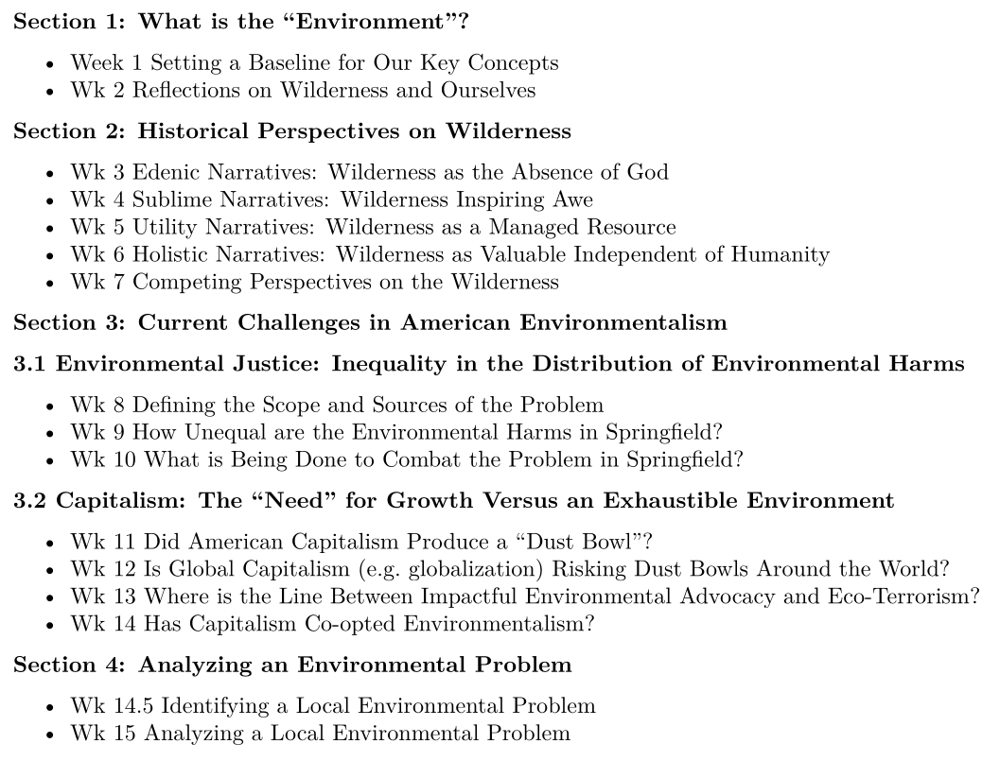
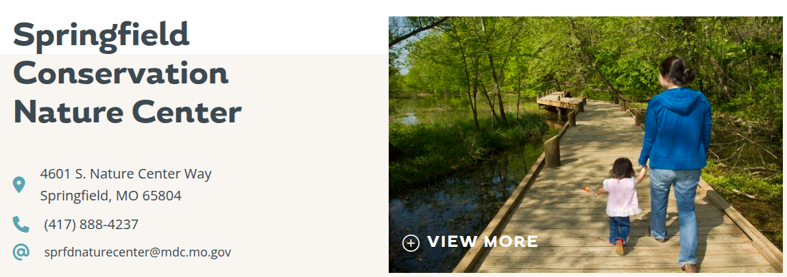

## Today's Agenda {background-image="Images/background-forest_v3.png" .center}

```{r}
library(tidyverse)
library(readxl)
library(kableExtra)
```

<br>

::: {.r-fit-text}

**Section 1: What is the "Environment"?**

- Defining "nature" using our backyard

:::

<br>

::: r-stack
Justin Leinaweaver (Fall 2026)
:::

::: notes
Prep for Class

1. Review Canvas submissions

<br>

Welcome back all!

<br>

**SLIDE**: Before we dive in, let's make sure everybody's ready to go!

:::


## The Answers are in the Syllabus {background-image="Images/background-forest_v3.png" .smaller}

<br>

::: {.panel-tabset}

### LOs


### Final Grades

{width="650"}

### Participation


### NO AI


:::

::: notes

**Any questions on the course, its structure or the policies in the syllabus?**

<br>

**SLIDE**: I've split our course plan into sections by topic

:::


## {background-image="Images/background-forest_v3.png" .center}

{style="display: block; margin: 0 auto"}

::: notes

In Section 1 we will set a baseline for the class

- We can't begin to interrogate the wilderness in useful ways until we clarify our prior assumptions

- e.g. whatis the wilderness to you?

<br>

In Section 2 we'll unpack the competing perspectives of wilderness that continue to shape our world today

- While many of the readings will be drawn from history, I promise you these debates remain VERY current

<br>

In Section 3 we'll explore a series of current day challenges we definitely haven't solved yet

<br>

Concerns about environmental justice boil down to a very simple problem

- Every modern economy produces pollution, and every society has to make decisions about how much pollution to allow and where to allow it

- In this section of the class we'll explore how our society decides these questions and how the impacts have been shared

<br>

Concerns about capitalism boil down to some very old ideas about whether you can run an economy on never-ending consumption if you live on a planet with finite resources

- This is a REALLY thorny problem that we don't have good answers for.

<br>

Then, in the final section of the semester, each of you will choose and analyze a local environmental problem using the material from our semester

<br>

**Questions on the big picture plan?**

<br>

Today we kick off our work in the first section of the class

- We need to get on the same page as a class in terms of defining our key concepts

<br>

**SLIDE**: In order to help us do that we'll need to get out into the world!

:::


## Next Thursday (Aug 27) {background-image="Images/background-forest_v3.png" .center}

<br>

{style="display: block; margin: 0 auto"}

::: notes

Next Thursday is our first field trip of the semester

- We're meeting at the Springfield Conservation Nature Center

- We'll gather there at noon and spend an hour exploring the site with the staff

<br>

**Does everybody have a car?**

<br>

I will give extra credit to anybody who car pools!

<br>

**SLIDE**: Today we use our backyard to define the key concept: "nature"

:::


## {background-image="Images/01_1-Drury_Campus.jpeg" .center}

::: notes

For today I asked each of you to explore our campus and submit photo evidence of your findings

<br>

**How did this go?**

- **Was this a simple enough task or not? Why?**

<br>

*Split class into small groups (3-4 each?)*

- Go sit with your group

<br>

**SLIDE**: Prompt 1

:::


## {background-image="Images/background-forest_v3.png" .center}

::: {.r-fit-text}
**"Wilderness" or "nature" in its purest form**

1. Review the cases, and

2. Make a list of shared qualities
:::

::: notes

1. Groups review and discuss the submissions, and 

2. Develop a list of the qualities you argue are common to all of these examples (or most of them)

<br>

Let's build a big list of qualities of "pure" nature!

- *ON BOARD*

<br>

**SLIDE**: Definition time

<br>

Canvas DISCUSSION: Reflecting on our Backyard - Pure Nature or Wilderness (2pts)

Take a photo of something on Drury's campus that you believe represents the wilderness or nature in its purest form.

Include the photo in your post and explain:

1) What specifically in the photo you want us to focus on, and
2) WHY this represents pure nature or wilderness.


:::


## {background-image="Images/background-forest_v3.png" .center}

::: {.r-fit-text}
**Define "pure wilderness / nature"**

- Aim for one complete sentence
:::

::: notes

Ok, groups, if these are the qualities we are interested in I want you to write me a concise definition of the concept

- Aim for one complete sentence

- Go!

<br>

*PRESENT and DISCUSS each*

- *YOU help steer groups towards different perspectives:*
    
    - Nature as resources for human use
    - Nature as all non-human entities with an emphasis on equal protection (not anthropocentric)
    - Nature as unspoiled (e.g. the absence of human interference)
    - Nature as an ecological system with an interplay between living and non-living things

<br>

*Mix up the groups!*

- Go sit with your new group!

- Introduce yourselves

<br>

**SLIDE**: Next prompt

:::


## {background-image="Images/background-forest_v3.png" .center}

::: {.r-fit-text}
**The absence of "wilderness" or "nature"**

1. Review the cases, and

2. Make a list of shared qualities
:::

::: notes

Now we jump to the opposite extreme, the absence of wilderness

<br>

Open up the third discussion board

- Let's once again build a big list of qualities

- Groups, review the cases and make a list of shared qualities

<br>

Let's build a big list of qualities of the "absence" of nature!

- *ON BOARD*

<br>

**SLIDE**: Definition time

:::


## {background-image="Images/background-forest_v3.png" .center}

::: {.r-fit-text}
**Define the "absence of wilderness / nature"**

- Aim for one complete sentence
:::

::: notes

Ok, groups, if these are the qualities we are interested in I want you to write me a concise definition of the concept

- Aim for one complete sentence

- Go!

<br>

*PRESENT and DISCUSS each*

<br>

Mix up the groups one last time!

- Make a group of 3 or 4 and aim for NEW people!

- Go!

<br>

**SLIDE**: Developing your scale

:::


## {background-image="Images/background-forest_v3.png" .center}

::: {.r-fit-text}
**The Wilderness / Nature Scale**

- Ten point scale

- 1 ("Not Nature") to 10 ("Pure Nature")
:::

::: notes

Imagine a 10 point scale bounded by these two definitions (e.g. scale from not nature to pure nature)

<br>

Everybody open our second discussion board that holds all our in-between cases

- Let's step through the cases

- Groups, you tell us where you would put this example on your version of the ten point scale and why

- *PRESENT and DISCUSS each*

<br>

**SLIDE**: In sum

:::


## {background-image="Images/background-forest_v3.png" .center}

::: {.r-fit-text}
**What is "the environment"?**

- e.g. "nature" or "wilderness"
:::

::: notes

**Ok, where do we end up?**

- **What is "nature" or the "wilderness"?**

- **Do we have one single definition or a few competing ones?**

<br>

**SLIDE**: Next class

:::


## For Next Class {background-image="Images/background-forest_v3.png" .center}

<br>

::: {.r-fit-text}

1. Read Nash (2014) Prologue

2. Share a personal wilderness experience

:::

::: notes

The Nash book is an excellent exploration of the American relationship with wilderness across time

- We'll dip our proverbial toe in the water by reading the prologue

<br>

THEN want you to share a wilderness or nature experience with the class.

- Something that has stuck with you for some reason.

- Tell us about the experience and why it has stuck with you.

<br>

The goal here is not to get awkwardly personal

- The goal for us is to identify the many different social, cultural and emotional roles nature plays in our lives.

<br>

**Questions on the assignment?**

<br>

T - (Nash 2014 p1-7 (prologue) and ASSIGNMENT)

Canvas DISCUSSION: Share a Wilderness Experience

What is a meaningful experience you have had in the "wilderness" or in "nature"? 

Describe the experience and what made it meaningful to you. 

Also, share a picture of the place so we can see some version of what you saw during the experience (personal or just from the internet). 


:::