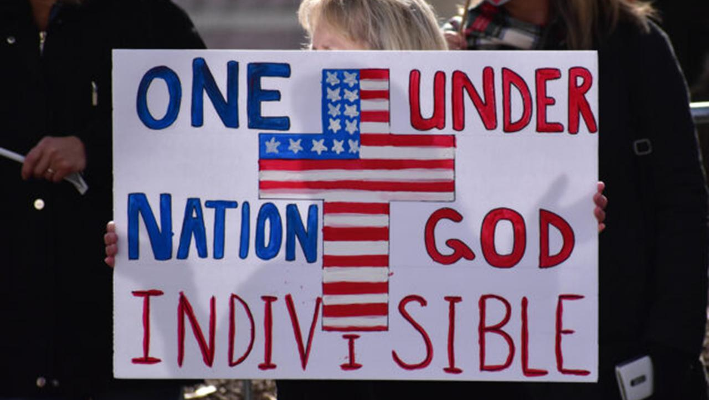
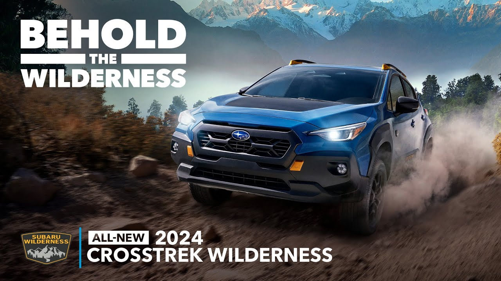

## Today's Agenda {background-image="Images/background-forest_v3.png" .center}

```{r}
library(tidyverse)
library(readxl)
library(kableExtra)
```

<br>

::: {.r-fit-text}

**Section 2: Historical Perspectives on Wilderness**

:::

- Reflecting on the Edenic narratives in our markets and politics

<br>

::: r-stack
Justin Leinaweaver (Fall 2026)
:::

::: notes
Prep for Class

1. Review Canvas submissions

<br>

**SLIDE**: Paper 1 due tomorrow

:::


## {background-image="Images/background-forest_v3.png" .center}

::: {.r-fit-text}
**Paper 1: The Importance of Wilderness**
:::

<br>

Make an argument that the wilderness is important to our community

- Due Friday

::: notes

Your first paper is due tomorrow

- **Any questions on the assignment?**

<br>

**SLIDE**: I only see you guys twice a week, so let's speed through how we've gotten to this point

:::


## {background-image="Images/background-forest_v3.png" .center}

::: {.r-fit-text}
**A Spectrum of Environments (Nash 2014)**
:::

<br>

```{r, fig.align = 'center', fig.width = 6, fig.height=1.25}
## Manual DAG
d1 <- tibble(
  x = c(-3, 3),
  y = c(1, 1),
  labels = c("Purely\nCivilized", "Purely\nWild")
)

ggplot(data = d1, aes(x = x, y = y)) +
  geom_point(size = 0) +
  theme_void() +
  coord_cartesian(xlim = c(-4, 4)) +
  geom_label(aes(label = labels), size = 7) +
  annotate("segment", x = -1.9, xend = 1.9, y = 1, yend = 1, arrow = arrow(ends = "both"))
```

::: notes

Talk to me about Nash's "spectrum of environments".

- **How is this an answer to the question, what is the wilderness or nature?**

- **In other words, what is this visualization trying to get us to consider?**

<br>

The wilderness is not a "thing," it is a quality.

- All environments can be placed on a scale from complete human control to the absence of direct human control

<br>

**For Nash, what characterizes a "purely civilized" environment?**

- (the highest levels of human interference or shaping of the environment)

<br>

**And on the other end, what characterizes a "purely wild" environment?**

- (meaning the absence of human influence on the environment)

<br>

Ok, so why do I keep hammering you with this approach to defining wilderness?

- **SLIDE**: 

:::


## {background-image="Images/03_2-tree_lined_street_v2.png" .center}

::: {.fragment}
### [We must abandon "the dualism that sees the tree in the garden as artificial...and the tree in the wilderness as natural... Both trees in some ultimate sense are wild; both in a practical sense now depend on our management and care" (Cronon 1996, 24).]{style="color:white;"}
:::

::: notes

I think the historian and naturalist William Cronon nails it with this quote

- **REVEAL**

- As someone deeply invested in solving problems in our community I REALLY love this idea

<br>

Fighting about what is or isn't wilderness is a waste of time

<br>

FIRST, that fight has no end

- As we saw, "wilderness" has no fixed definition across cultures, places, government agencies or times

<br>

SECOND, it implies that ONLY the wild lands deserve our protection

- Don't give up your agency before getting to work!

- ALL environments have wild elements and our world is better off when we plan for them

<br>

Bottom line from the Nash perspective, protecting and promoting wilderness is a valuable activity no matter what your current environment looks like!

- We have responsibilities to resource management BOTH in the "wild places" AND where humans live too!

<br>

**Kind of cool, right?**

- I like when the broadly philosophical or historical material lends itself this directly to practical advice for policy-making

<br>

**SLIDE**: This week we moved from conceptualizing wilderness in broad terms and began exploring our first historical perspective on wilderness

:::


## {background-image="Images/03_1-Garden_Eden.jpg" .center}

::: notes

Let's recap the Edenic narrative of wilderness

<br>

**How does the Old Testament present the wilderness?**

- (The absence of god; A place of corruption)

- (A desert or wasteland where your survival is threatened)

- (KJ, Genesis 1:28: "And God blessed them, and God said unto them, Be fruitful, and multiply, and replenish the earth, and subdue it: and have dominion over the fish of the sea, and over the fowl of the air, and over every living thing that moveth upon the earth.")

<br>

**When William Bradford looked out into the wilderness beyond the borders of his colonial home, what did he see?**

- (Emptiness and death)

- ("Besides, what could they see but a hideous and desolate wilderness, fall of wild beasts and wild men—and what multitudes there might be of them they knew not" (Chapter IX).)

<br>

There is clearly an Old Testament perspective being expressed by Bradford when he looks at the wilderness

- But let's hold our conversation about the White (1967) argument until the end of class

<br>

If the wilderness is the absence of God and a threat to our very survival, then the Edenic narrative is a story in which we must spoil the wilderness!

- **What does Wernick mean by "spoil"?**

- (He means we should make it productive, e.g. make it useful to improve human lives and well being.)

<br>

**What did you think were the strongest parts of Wernick's argument?**

- (Wilderness can be very dangerous)

- (Wilderness advocates are often inconsistent)

- (Wilderness preservation is just one legitimate use of our resources no better than building roads, mining or erecting cities)

<br>

Wernick might be a bad writer in terms of developing a convincing argument, BUT

- He's not wrong that we live in a world full of need and the wilderness offers resources that could be used to address those needs

<br>

Let's now track the edenic narrative in our world today

- **SLIDE**

:::


## {background-image="Images/background-forest_v3.png" .center}

::: {.r-fit-text}
**The Frequency and Impact of Edenic Narratives**

1. Arguments Targeting Consumers

2. Arguments Targeting Citizens
:::


::: notes

Your assignment for today was to find us examples of this Edenic narrative in the world around us

1. Find a product or service that sells itself to you rooted in the arguments of the edenic narrative

2. Find an argument or call to public action that frames itself using the assumptions of the edenic narrative

<br>

This exercise is meant to both:

1. Reinforce our understanding of the first perspective, AND 

2. To see how far these arguments extend to the modern day!

<br>

**How did this go?**

<br>

*Split class into groups of four*

- *Five groups of four are what 300 can handle in separate clusters*

- Go sit with your group!

<br>

**SLIDE**: Let's start by talking about our lives as consumers!

<br>

Canvas DISCUSSION: The Value of the Wilderness Is Maximized Through Productive Use

Find us two examples of this week's perspective, whether implicitly suggested or explicitly stated, being deployed in our community today (e.g. local, state, national or global). No overlapping cases (first-come, first-served).

1. Arguments for Consumers: Find a product, service or experience for sale that is designed to help us extract the most value from wilderness or nature. Submit: 1) A web link to the product/service/experience, and 2) An explanation of HOW the marketing for this item connects it to the Edenic narratives we explored last class (3+ sentences).

2. Arguments for Citizens: Find an example of someone arguing that we should "open up" or increase our use of a specific wilderness or natural area in order to extract more value from it. Submit: 1) A link to the argument, 2) a brief summary of the argument (2+ sentences), and 3) An explanation of HOW this argument connects it to the Edenic narratives we explored last class (3+ sentences).

:::


## Edenic Narratives of Wilderness {background-image="Images/background-forest_v3.png" .center}

<br>

### Find a product, service or experience for sale that is designed to help us extract the most value from wilderness or nature

::: {.fragment}
- How common is the Edenic narrative in our consumer lives?
:::

::: notes

Groups, start by focusing on the consumer side of our lives (e.g. Canvas Assignment Q1)

- Take some time to review all the submitted cases and get ready to report back your experience of doing this assignment

- **REVEAL: Specifically, I want you to tell me, how common is the Edenic narrative in the marketing of products and services to American consumers?**

<br>

*REPORT back and DISCUSS*

<br>

**SLIDE**: Review 2

:::


## Edenic Narratives of Wilderness {background-image="Images/background-forest_v3.png" .center}

<br>

### Find a product, service or experience for sale that is designed to help us extract the most value from wilderness or nature

- Which specific messages were most effective on you? Why?

::: notes

Groups, dig back into the cases and get ready to report back

- **Which specific messages work most effectively on you?**

- **In other words, what makes you want to spend some money? Why?**

<br>

*REPORT back and DISCUSS*

- *ON BOARD*

<br>

**SLIDE**: Reflect on this as a class

:::


## Edenic Narratives of Wilderness {background-image="Images/background-forest_v3.png" .center}

<br>

### Why is the Edenic narrative so common in our marketplace?

- American consumers are moved by these arguments?

- Companies are motivated to spread these arguments?

::: notes

**CLASS: What do we think explains the commonness of this narrative in our marketing?**

- **Is it that these messages work well on American consumers OR that companies want to push it on us? Or both?**

<br>

*DISCUSS*

<br>

**SLIDE**: Let's shift to political arguments

:::


## Edenic Narratives of Wilderness {background-image="Images/background-forest_v3.png" .center}

<br>

### Find an example of someone arguing that we should "open up" or increase our use of a specific wilderness or natural area in order to extract more value from it

- List 1: Reasons you find compelling

- List 2: Reasons that do not work on you at all

::: notes

Groups, take a few minutes to review the political arguments submitted on Canvas (Q2)

- Reflect on the arguments and build two lists to share with us

- Flag the specific messages that you find most compelling and those that don't work on you at all

- Importantly, you don't have to agree with the conclusion of the argument!

<br>

*PRESENT and DISCUSS each*

- *ON BOARD*

<br>

**SLIDE**: Now let's go back to White's (1967) argument!

:::


## {background-image="Images/background-forest_v3.png" .center}

### Does our evidence today reinforce or conflict with White's (1967) argument?

:::: {.columns}
::: {.column width="50%"}

:::

::: {.column width="50%"}

:::
::::

::: notes

White's (1967) argument finds the roots of our current environmental catastrophes in the distant past

- Specifically he notes that the development of western science and technology was “cast in a matrix of Christian theology”

- A theology that taught us that God had created the world to serve man’s purposes

<br>

Now, White's evidence and focus is on the medeival period

- **My question, is does our evidence suggest this problematic connection has continued up to today?**

- **In other words, are you persuaded that majority Christian societies are ones where environmental protection will be harder to design? Why or why not?**

<br>

**SLIDE**: Next class

:::


## For Next Class {background-image="Images/background-forest_v3.png" .center}

<br>

### Sublime Narratives of Wilderness

1. Read the excerpts from Thoreau, Muir, Cole and Denevan

2. Submit your reflection on the divide between history and perspective in these writings


::: notes

Next week we shift to our next historical perspective on wilderness

- Some hugely influential writers teed up for us here

<br>

**Questions on the assignment?**

<br>

IFF time remaining in class:

- **Any last questions on the paper?**

:::
