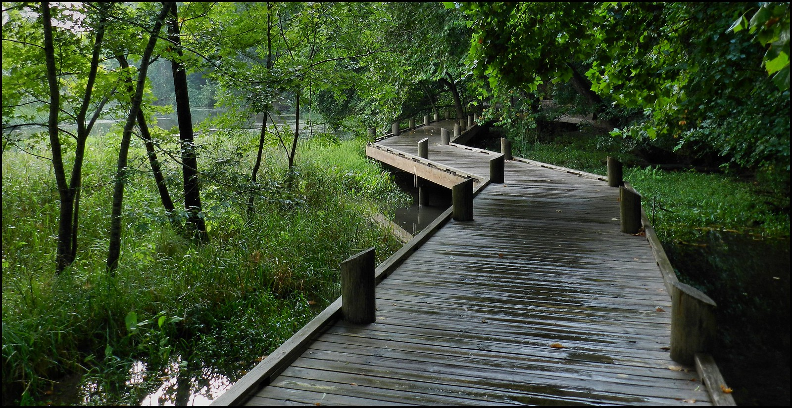

## Today's Agenda {background-image="Images/background-forest_v3.png" .center}

```{r}
library(tidyverse)
library(readxl)
library(kableExtra)
```

<br>

::: {.r-fit-text}

**Section 2: Historical Perspectives on Wilderness**

- Sublime Narratives: Wilderness as Inspiring Awe

:::

<br>

::: r-stack
Justin Leinaweaver (Fall 2026)
:::

::: notes
Prep for Class

1. Review Canvas assignments

2. Post the Cole poem in case you have time for it in class

    - Cole, T. (1841, June). The Lament of the Forest. The Knickerbocker: Or, New-York Monthly Magazine, 17, 516–519.
    
<br>

**SLIDE**: Once again, let's review the path we have walked thus far

:::


## {background-image="Images/background-forest_v3.png" .center}

::: {.r-fit-text}
**A Spectrum of Environments (Nash 2014)**
:::

<br>

```{r, fig.align = 'center', fig.width = 6, fig.height=1.25}
## Manual DAG
d1 <- tibble(
  x = c(-3, 3),
  y = c(1, 1),
  labels = c("Purely\nCivilized", "Purely\nWild")
)

ggplot(data = d1, aes(x = x, y = y)) +
  geom_point(size = 0) +
  theme_void() +
  coord_cartesian(xlim = c(-4, 4)) +
  geom_label(aes(label = labels), size = 7) +
  annotate("segment", x = -1.9, xend = 1.9, y = 1, yend = 1, arrow = arrow(ends = "both"))
```

::: notes

**Big picture, what is our takeaway about the "wilderness" concept from Nash's historical analysis?**

- (The wilderness is a quality of something, not a concrete thing to be identified)

<br>

**In the spectrum, how does Nash define "purely civilized"?**

- (meaning the highest levels of human interference or shaping of the environment)

<br>

**And how does Nash define the "purely wild"?**

- (meaning the absence of human influence on the environment)

<br>

**And what does Cronon argue is our important takeaway from recognizing all of this?**

- (**SLIDE**)

:::


## {background-image="Images/03_2-tree_lined_street_v2.png" .center}

### [We must abandon "the dualism that sees the tree in the garden as artificial...and the tree in the wilderness as natural... Both trees in some ultimate sense are wild; both in a practical sense now depend on our management and care" (Cronon 1996, 24).]{style="color:white;"}

::: notes

Caring about the wilderness means feeling responsible for EVERY environment

- We can, and probably should, foster some wildness in all our outdoor environments!

<br>

So, don't get bogged down in debates about what is or isn't natural, focus on what you can do to promote wilderness everywhere

<br>

**SLIDE**: Applying the scale is hard in practice

:::


## {background-image="Images/background-forest_v3.png" .center}

### Why is it so hard to rate the SGF Conservation Nature Center on a scale of 0 (purely civilized) to 10 (purely wild)?

{style="display: block; margin: 0 auto"}

::: notes

**Why was it so hard for us to classify the SGF Conservation Nature Center on a scale of 0 (purely civilized) to 10 (purely wild)?**

<br>

The ratings exercise depends on which elements you choose as most important and which to ignore

- Everyone has a different perspective on what wilderness is and how it should be valued

- Put differently, placement on the scale depends on making clear your assumptions

<br>

**SLIDE**: Let's use the Edenic perspective AS our assumptions for this exercise!

:::


## {background-image="Images/04_1-Cole_Thomas_Expulsion_from_the_Garden_of_Eden_1828.jpg" .center}

::: notes

Once again, here we see Thomas Cole's famous painting, Expulsion from the Garden of Eden (1828)

- **Remind me, how does Eden compare to the wilderness in this story?**

<br>

**So, if I asked you to adopt the Edenic perspective on wilderness, what would that mean you need to focus on?**

<br>

The Edenic perspective views wilderness as:

1. A place without God

2. A place of temptation, suffering and danger, and

3. A place that exists to serve the needs of humanity

<br>

**SLIDE**: This means the Edenic mission in the wilderness is...

:::


## {background-image="Images/04_1-Cole_Thomas_Expulsion_from_the_Garden_of_Eden_1828.jpg"}

[**The Edenic Narrative**]{style="color:white;"}

- [**We should dominate all aspects of the wilderness, and**]{style="color:white;"}

- [**We should maximally exploit all of its resources**]{style="color:white;"}

::: notes

Maximizing human control of the wilderness, including:

1. Economic exploitation of all its resources, and 

2. Human domination of everything we find out "there"

<br>

**Everybody with me on this?**

<br>

**SLIDE**: Ok, so now let's answer the reframed question

:::


## {background-image="Images/background-forest_v3.png" .center}

### Using the Edenic perspective on wilderness rate the SGF Conservation Nature Center on a scale from 0 (purely civilized) to 10 (purely wild)?

```{r, fig.align = 'center', fig.width = 6, fig.height=1.25}
## Manual DAG
d1 <- tibble(
  x = c(-3, 3),
  y = c(1, 1),
  labels = c("Purely\nCivilized", "Purely\nWild")
)

ggplot(data = d1, aes(x = x, y = y)) +
  geom_point(size = 0) +
  theme_void() +
  coord_cartesian(xlim = c(-4, 4)) +
  geom_label(aes(label = labels), size = 7) +
  annotate("segment", x = -1.9, xend = 1.9, y = 1, yend = 1, arrow = arrow(ends = "both"))
```

::: notes

**What is your rating of the SGF Conservation Nature Center if you adopt the Edenic perspective on wilderness?**

<br>

To me, this perspective would view the SGF Conservation Nature Center on the wilderness side of the mid-point on the scale

- There is extensive control and management by man, and

- The area is widely used for human recreation, BUT

- The allowable list of uses is HEAVILY proscribed

- Pushing the Nature Center to the other end of the spectrum would require widening the list of allowable exploitation activities

<br>

**You guys buying this application?**

- **Does it make sense how one's position on the scale depends on other key assumptions?**

<br>

THIS is one of the big reasons we spend these early weeks exploring and reflecting on the perspectives

- Each different perspective is a shortcut to understanding the debates about the environment we see around us today

<br>

**SLIDE**: With that in mind, let's talk about our evidence of the Edenic narrative in the world around us

:::


## {background-image="Images/04_1-2024_Subaru_Compact_SUV_desert_xl.png" .center}

::: notes

Nothing says AI generated freedom like watching a car drive through a wilderness!

<br>

**Give me specific examples of this perspective in our consumer lives (e.g. products or services for sale)**

<br>

**Give me specific examples of this perspective in our political discourse**

<br>

**Which kinds of Edenic arguments do you find most compelling? Why?**

<br>

**What are the benefits of adopting this perspective?**

- **In other words, if society decided this was the "correct" lens for making resource decisions, who would benefit? How?**

- (Might maximize short term growth and provide immediate economic benefits to society)

<br>

**Contra those, what are the dangers to society decided this was the "correct" lens for making resource decisions?**

- (ecological catastrophe, long-term risk)

<br>

**Anything I didn't mention about this perspective you want to make sure we keep in mind moving forward?**

<br>

**SLIDE**: Next steps

:::


## {background-image="Images/background-forest_v3.png" .center}

::: {.r-fit-text}

**Section 2: Historical Perspectives on Wilderness**

- Edenic Narratives

- Sublime Narratives

- Utility Narratives

- Holistic Narratives

:::

::: notes

This week we shift to our next perspective: The Sublime Narrative of Wilderness

- I suspect many of you will feel great affinity for this perspective

- Very appealing intuitions

- I was able to assign you excerpts for today from some of my favorite writers about the natural experience

<br>

It can be hard to have a seminar style chat with this many people so we'll do a mix of group pre-work and class discussion

- *Split class into small groups (3 per group)*

- Go sit with your group!

<br>

**SLIDE**: Let's begin with Thoreau's climb up Mount Katadin!

:::


## {background-image="Images/04_1-Mount_Katahdin.jpg" .center}

::: notes

**Has anybody visited Mount Katahdin in Maine?**

<br>

Mount Katahdin

- Translates to "Greatest Mountain" in Penobscot

- Is the highest mountain in the state of Maine at 5,269 feet

- Considered sacred by the Maliseet, Micmac, Passamaquoddy, and Penobscot nations

<br>

**SLIDE**: Prompts

:::


## {background-image="Images/04_1-Mount_Katahdin_v2.png" .center}

::: {.r-fit-text}
Thoreau, H. D. (1906). *The Maine Woods*.

1. What is the wilderness?

2. What is the value of wilderness?
:::

::: notes

Henry David Thoreau is a towering figure in the American intellectual history of the wilderness and nature

- **Has anybody read any of his classic *Walden*?**

- (A very dry read, but important nontheless...)


<br>

Groups take a few minutes to discuss the excerpt from Henry David Thoreau's *The Main Woods* that recounts his climbing of Mount Katahdin

- The aim is to get a sense of how Thoreau defines wilderness AND how he conceives of its value

- Be ready to report back on your conclusions and where in the text you find evidence for them

<br>

*PRESENT and DISCUSS key elements*

- *Keep this open and encourage everyone to get involved in the discussion*

<br>

**SLIDE**: Ok, don't lose sight of this, but now let's jump to the Muir piece.

<br>

*Notes from the reading, KTAADN notes for p223*

- "Leaving this at last, I began to work my way, scarcely less arduous than Satan’s anciently through Chaos, up the nearest though not the highest peak. At first scrambling on all fours over the tops of ancient black spruce trees (Abies nigra), old as the flood, from two to ten or twelve feet in height, their tops flat and spreading, and their foliage blue, and nipped with cold, as if for centuries they had ceased growing upward against the bleak sky, the solid cold" (p27).

- "It reminded me of the creations of the old epic and dramatic poets, of Atlas, Vulcan, the Cyclops, and Prometheus. Such was Caucasus and the rock where Prometheus was bound. Æschylus had no doubt visited such scenery as this. It was vast, Titanic, and such as man never inhabits. Some part of the beholder, even some vital part, seems to escape through the loose grating of his ribs as he ascends. He is more lone than you can imagine. There is less of substantial thought and fair understanding in him than in the plains where men inhabit. His reason is dispersed and shadowy, more thin and subtile, like the air. Vast, Titanic, inhuman Nature has got him at disadvantage, caught him alone, and pilfers him of some of his divine faculty. She does not smile on him as in the plains. She seems to say sternly, Why came yehere before your time. This ground is not prepared for you. Is it not enough that I smile in the valleys? I have never made this soil for thy feet, this air for thy breathing, these rocks for thy neighbors. I cannot pity nor fondle thee here, but forever relentlessly drive thee hence to where I am kind. Why seek me where I have not called thee, and then complain because you find me but a stepmother? Shouldst thou freeze or starve, or shudder thy life away, here is no shrine, nor altar, nor any access to my ear" (28-29).

- "The tops of mountains are among the unfinished parts of the globe, whither it is a slight insult to the gods to climb and pry into their secrets, and try their effect on our humanity. Only daring and insolent men, perchance, go there. Simple races, as savages, do not climb mountains,—their tops are sacred and mysterious tracts never visited by them. Pomola is always angry with those who climb to the summit of Ktaadn" (29).

- "Perhaps I most fully realized that this was primeval, untamed, and forever untamable Nature, or whatever else men call it, while coming down this part of the mountain. We were passing over “Burnt Lands,” burnt by lightning, perchance, though they showed no recent marks of fire, hardly so much as a charred stump, but looked rather like a natural pasture for the moose and deer, exceedingly wild and desolate, with occasional strips of timber crossing them, and low poplars springing up, and patches of blueberries here and there. I found myself traversing them familiarly, like some pasture run to waste, or partially reclaimed by man; but when I reflected what man, what brother or sister or kinsman of our race made it and claimed it, I expected the proprietor to rise up and dispute my passage. It is difficult to conceive of a region uninhabited by man. We habitually presume his presence and influence everywhere. And yet we have not seen pure Nature, unless we have seen her thus vast and drear and inhuman, though in the midst of cities. Nature was here something savage and awful, though beautiful. I looked with awe at the ground I trod on, to see what the Powers had made there, the form and fashion and material of their work. This was that Earth of which we have heard, made out of Chaos and Old Night. Here was no man’s garden, but the unhandseled globe. It was not lawn, nor pasture, nor mead, nor woodland, nor lea, nor arable, nor waste land. It was the fresh and natural surface of the planet Earth, as it was made forever and ever,—to be the dwelling of man, we say,—so Nature made it, and man may use it if he can. Man was not to be associated with it. It was Matter, vast, terrific,—not his Mother Earth that we have heard of, not for him to tread on, or be buried in,—no, it were being too familiar even to let his bones lie there,—the home, this, of Necessity and Fate. There was clearly felt the presence of a force not bound to be kind to man. It was a place for heathenism and superstitious rites,—to be inhabited by men nearer of kin to the rocks and to wild animals than we. We walked over it with a certain awe, stopping, from time to time, to pick the blueberries which grew there, and had a smart and spicy taste. Perchance where our wild pines stand, and leaves lie on their forest floor, in Concord, there were once reapers, and husbandmen planted grain; but here not even the surface had been scarred by man, but it was a specimen of what God saw fit to make this world. What is it to be admitted to a museum, to see a myriad of particular things, compared with being shown some star’s surface, some hard matter in its home! I stand in awe of my body, this matter to which I am bound has become so strange to me. I fear not spirits, ghosts, of which I am one,—that my body might,—but I fear bodies, I tremble to meet them. What is this Titan that has possession of me? Talk of mysteries! Think of our life in nature,—daily to be shown matter, to come in contact with it,—rocks, trees, wind on our cheeks! the solid earth! the actual world! the common sense! Contact!

Contact! Who are we? where are we?" (30-31).

- "After such a voyage, the troubled and angry waters, which once had seemed terrible and not to be trifled with, appeared tamed and subdued; they had been bearded and worried in their channels, pricked and whipped into submission with the spike-pole and paddle, gone through and through with impunity, and all their spirit and their danger taken out of them, and the most swollen and impetuous rivers seemed but playthings henceforth. I began, at length, to understand the boatman’s familiarity with, and contempt for, the rapids" (32-33).

- "Thus a man shall lead his life away here on the edge of the wilderness, on Indian Millinocket Stream, in a new world, far in the dark of a continent, and have a flute to play at evening here, while his strains echo to the stars, amid the howling of wolves; shall live, as it were, in the primitive age of the world, a primitive man" (33).

- "What is most striking in the Maine wilderness is the continuousness of the forest, with fewer open intervals or glades than you had imagined. Except the few burnt lands, the narrow intervals on the rivers, the bare tops of the high mountains, and the lakes and streams, the forest is uninterrupted. It is even more grim and wild than you had anticipated, a damp and intricate wilderness, in the spring everywhere wet and miry. The aspect of the country, indeed, is universally stern and savage, excepting the distant views of the forest from hills, and the lake prospects, which are mild and civilizing in a degree. The lakes are something which you are unprepared for; they lie up so high, exposed to the light, and the forest is diminished to a fine fringe on their edges, with here and there a blue mountain, like amethyst jewels set around some jewel of the first water,—so anterior, so superior, to all the changes that are to take place on their shores, even now civil and refined, and fair as they can ever be. These are not the artificial forests of an English king,—a royal preserve merely. Here prevail no forest laws but those of nature. The aborigines have never been dispossessed, nor nature disforested" (34-35).

:::


## {background-image="Images/04_1-Sierra_Nevada_Mountains.jpg" .center}

::: notes

**Has anybody visited the Sierra Nevada mountains in California and Nevada?**

<br>

The Sierra Nevada mountains

- Massive mountain range (400 miles long, 50-80 miles wide)

- The Sierra is home to three national parks, twenty-six wilderness areas, ten national forests, and two national monuments. 

- These areas include Yosemite, Sequoia, and Kings Canyon National Parks, as well as Devils Postpile National Monument.

<br>

**SLIDE**: Prompts

:::


## {background-image="Images/04_1-Sierra_Nevada_Mountains_v2.png" .center}

::: {.r-fit-text}
Muir, J. (1917). *My First Summer in the Sierra: Vol. II*

1. What is the wilderness?

2. What is the value of wilderness?
:::

::: notes

You simply cannot write a history of American environmentalism without considering the role of John Muir.

- Founder of the Sierra Club in 1892

- Led the battle to preserve the Hetch-Hetchy valley

- And so much more...

<br>

Groups take a few minutes to discuss the excerpt from Muir's diary from exploring the Sierra Nevadas

- The aim is to get a sense of how Muir defines wilderness AND how he conceives of its value

- Be ready to report back on your conclusions and where in the text you find evidence for them

<br>

*PRESENT and DISCUSS key elements*

- *Keep this open and encourage everyone to get involved in the discussion*

<br>

**SLIDE**: On to Thomas Cole's essay on the wilderness

:::


## {background-image="Images/04_1-Thomas_Cole_Landscape.jpg" .center}

::: notes

Thomas Cole (February 1, 1801 – February 11, 1848) was an American artist and the founder of the Hudson River School art movement.

- Cole used his art to explore themes of nature's spiritual power, the impact of industrialization on the landscape, and humanity's complex relationship with the wilderness.

- His *Essay on American Scenery* is a powerful argument for the preservation of American wilderness

<br>

**SLIDE**: Prompts

:::


## {background-image="Images/04_1-Thomas_Cole_Landscape_v2.png" .center}

::: {.r-fit-text}
Cole, T. (1836, January). *Essay on American Scenery*.

1. What is the wilderness?

2. What is the value of wilderness?
:::

::: notes

Alright groups, let's do this one more time

- The aim is to get a sense of how Cole defines wilderness AND how he conceives of its value

- Be ready to report back on your conclusions and where in the text you find evidence for them

<br>

*PRESENT and DISCUSS key elements*

- *Keep this open and encourage everyone to get involved in the discussion*

<br>

*IFF time remains post on Canvas the Cole, T. (1841, June). The Lament of the Forest. The Knickerbocker: Or, New-York Monthly Magazine, 17, 516–519.*

- *Cole 1841 poem makes clearer the threat is coming! Reads like Lord of the Rings at the end, no?*

<br>

**SLIDE**: Back to the Nature Center

:::


## {background-image="Images/background-forest_v3.png" .center}

::: {.r-fit-text}
**A Spectrum of Environments (Nash 2014)**
:::

<br>

```{r, fig.align = 'center', fig.width = 6, fig.height=1.25}
## Manual DAG
d1 <- tibble(
  x = c(-3, 3),
  y = c(1, 1),
  labels = c("Purely\nCivilized", "Purely\nWild")
)

ggplot(data = d1, aes(x = x, y = y)) +
  geom_point(size = 0) +
  theme_void() +
  coord_cartesian(xlim = c(-4, 4)) +
  geom_label(aes(label = labels), size = 7) +
  annotate("segment", x = -1.9, xend = 1.9, y = 1, yend = 1, arrow = arrow(ends = "both"))
```

::: notes

Ok, sum this all up for me.

- **What are the assumptions you accept if you adopt the sublime perspective on wilderness?**

<br>

- Wilderness is terrifying, but in a good way!

- The value of wilderness is in its alien / non-human nature

- We enter it as pilgrims ready to be dominated and awestruck

<br>

**SLIDE**: And then the rating exercise

:::


## {background-image="Images/background-forest_v3.png" .center}

### Adopting the sublime perspective on wilderness, rate the SGF Conservation Nature Center on a scale from 0 (purely civilized) to 10 (purely wild)?

```{r, fig.align = 'center', fig.width = 6, fig.height=1.25}
## Manual DAG
d1 <- tibble(
  x = c(-3, 3),
  y = c(1, 1),
  labels = c("Purely\nCivilized", "Purely\nWild")
)

ggplot(data = d1, aes(x = x, y = y)) +
  geom_point(size = 0) +
  theme_void() +
  coord_cartesian(xlim = c(-4, 4)) +
  geom_label(aes(label = labels), size = 7) +
  annotate("segment", x = -1.9, xend = 1.9, y = 1, yend = 1, arrow = arrow(ends = "both"))
```

::: notes

Groups, discuss your answers to Canvas Q1 and get ready to report back

- **What is your rating of the SGF Conservation Nature Center if you adopt the sublime perspective on wilderness?**

- (The Edenic narrative sees the Center as a wilder place)

- (The sublime narrative sees a Lowes garden center)

    - A nature completely dominated by our hand
    
    - A nature made completely "safe"

<br>

**From the sublime perspective, is the Springfield Conservation Nature Center a good use of wilderness? Why or why not?**

- (Maybe. It is better than nothing)

- (BUT, this ain't the wilderness and visiting it will not do for us what these writers believed we need to have happen to open our minds, hearts and souls)

<br>

**SLIDE**: Finally, how does Denevan's (1992) argument impact the sublime narrative?

:::


## {background-image="Images/background-forest_v3.png" .center}

Denevan, W. (1992). "The Pristine Myth: The Landscape of the Americas in 1492." *Annals of the Association of American Geographers*. 82 (1992): 369-85.

<br>

How does Denevan's (1992) argument impact your understanding of the sublime perspective on wilderness and nature? 

- Does it contradict the views of Thoreau, Muir and Cole, reinforce them, or do something else?

::: notes

Groups, discuss your answers to Canvas assignment Q2 and get ready to report back!

- *Your Denevan notes at bottom*

- *Report back and discuss*

<br>

**Are we clear on what precisely Denevan is arguing?**

- (Human beings have ALWAYS modified our environments to survive and thrive)

- "By 1492, Indian activity had modified vegetation and wildlife, caused erosion, and created earthworks, roads, and settlements through-out the Americas. This may be obvious, but the human imprint was much more ubiquitous and enduring than is usually realized."

<br>

**Why might the writers and painters in the sublime narrative group see a pristine wilderness when they look outside?**

- (Because we had wiped out the native populations)

- "Equally important, most of our eyewitness descriptions of wilderness and empty lands come from a later time, particularly 1750-1850 when interior lands began to be explored and occupied by Europeans. By 1650, Indian populations in the hemisphere had been reduced by about 90 percent, while by 1750 European numbers were not yet substantial and settlement had only begun to expand. As a result, fields had been abandoned, while settlements vanished, forests recovered, and savannas retreated. The landscape did appear to be a sparsely populated wilderness" (379).

<br>

**Per the historical record, has there ever been a "purely wild" wilderness once humans reached it?**

- “The human impact on environment is not simply a process of increasing change or degradation in response to linear population growth and economic expansion. It is instead interrupted by periods of reversal and ecological rehabilitation as cultures collapse, populations decline, wars occur, and habitats are abandoned. Impacts may be constructive, benign, or degenerative (all subjective concepts), but change is continual at variable rates and in different directions. Even mild impacts and slow changes are cumulative, and the long-term effects can be dramatic. Is it possible that the thousands of years of human activity before Columbus created more change in the visible landscape than has occurred subsequently with European settlement and resource exploitation? The answer is probably yes for most regions for the next 250 years or so, and for some regions right up to the present time” (381).

<br>

**SLIDE**: Assignment for next class

<br>

*Notes from Denevan (1992)*

- Romanticist and primativist writers like Hudson, Cooper, thoreau, Longfellow, Parkman and painters like Caitline and Church advocated a pristine view of America as a "sparsely populated wilderness, 'a world of barely perceptible human disturbance'" (369).

- "To the contrary, the Indian impact was neither benign nor localized and ephemeral, nor were resources always used in a sound ecological way" (370).

- "The evidence is convincing. By 1492 Indian activity throughout the Americas had modified forest extent and composition, created and expanded grasslands, and rearranged microrelief via countless artificial earthworks. Agricultural fields were common, as were houses and towns and roads and trails. All of these had local impacts on soil, microclimate, hydrology, and wildlife" (370).

- Interestingly, "the Indian landscape of 1492 had largely vanished by the mid-eighteenth century, not through a European superimposition, but because of the demise of the native population. The landscape of 1750 was more 'pristine' (less humanized) than that of 1492" (370).

- "Indian Numbers" (370) were substantial in 1492 (e.g. 40-100 million in the hemisphere! Denevan suspects a tighter range of 43-65 million)

- "Vegetation: The Eastern Forests" (371): Indian burning of forests for agriculture and ease of hunting creates a forest with wide broken up areas of grassy lowlands. This remains a point of controversy in academia.

- "Vegetation: Forest Composition" (372): Fire extensively alters forest composition. Example: 'Fire created conditions favorable to strawberries, blackberries, raspberries, and other gatherable foods (Cronon 1983).'

- "Vegetation: Midwest Prairies and Tropical Savannas" (372)

- "Vegetation: Anthropegnic Tropical Rain Forest" (373): Evidence of fires plus "manipulation of swidden fallows (sequential agroforestry) to increase useful species. "The planting, transplanting, sparing, and protection of useful wild, fallow plants eliminates clear distinctions between field and fallow (Denevan and Padoch 1988)."

- "Wildlife" (375): Evidence remains controversial, but forest composition changes did seems to increase the range and amount of useful creatures that impressed the colonists so much about the new world.

- "Agriculture" (375): "Fields and Associated Features", "Erosion"

- "The Built Landscape" (376): "Settlement", "Mounds", "Roads, Causeways and Trails"

- "Recovery" (377): "A strong case can be made for significant environmental recovery and reduction of cultural features by the late eighteenth century as a result of Indian population decline." ... "Wildlife also partially recovered in eastern North America with reduced hunting pressure from Indians; however, this is also a story yet to be worked out" (378).

- "Conclusions" (379)

- "By 1492, Indian activity had modified vegetation and wildlife, caused erosion, and created earthworks, roads, and settlements through-out the Americas. This may be obvious, but the human imprint was much more ubiquitous and enduring than is usually realized."

- "The weight of evidence suggests that Indian populations were large..."

- "The roots of the pristine myth lie in part with early observers unaware of human impacts that may be obvious to scholars today, particularly for vegetation and wildlife."

- "Equally important, most of our eyewitness descriptions of wilderness and empty lands come from a later time, particularly 1750-1850 when interior lands began to be explored and occupied by Europeans. By 1650, Indian populations in the hemisphere had been reduced by about 90 percent, while by 1750 European numbers were not yet substantial and settlement had only begun to expand. As a result, fields had been abandoned, while settlements vanished, forests recovered, and savannas retreated. The landscape did appear to be a sparsely populated wilderness."

- "The human impact on environment is not simply a process of increasing change or degradation in response to linear population growth and economic expansion. It is instead interrupted by periods of reversal and ecological rehabilitation as cultures collapse, populations decline, wars occur, and habitats are abandoned. Impacts may be constructive, benign, or degenerative (all subjective concepts), but change is continual at variable rates and in different directions. Even mild impacts and slow changes are cumulative, and the long-term effects can be dramatic. Is it possible that the thousands of years of human activity before Columbus created more change in the visible landscape than has occurred subsequently with European settlement and resource exploitation? The answer is probably yes for most regions for the next 250 years or so, and for some regions right up to the present time" (381).

:::


## For Next Class {background-image="Images/background-forest_v3.png" .center}

<br>

**Sublime Narratives of Wilderness**

1. Arguments for Consumers: Find a product or service

2. Arguments for Citizens: Find an argument or call to action


::: notes

Alright, just like last week, your job for next class is to bring this sublime material into our current world!

- In short, we want to gather products being sold today and arguments that are currently being employed that are built on the sublime narrative we've been exploring 

- The details are on Canvas

<br>

**Questions on the assignment?**

<br>

Canvas DISCUSSION: Reflecting on the Sublime Narratives Around Us 

Find us two examples of this week's perspective, whether implicitly suggested or explicitly stated, being deployed in our community today (e.g. local, state, national or global). No overlapping cases (first-come, first-served).

1. Arguments for Consumers: Find a product, service or experience for sale that is designed to help us enjoy the wilderness or nature in its most "pristine" condition. Submit: 1) A web link to the product/service/experience, and 2) An explanation of HOW the marketing for this item connects it to the sublime narratives we explored last class (3+ sentences).

2. Arguments for Citizens: Find an example of someone arguing that we should preserve some specific piece of wilderness or nature in order to maximize its value. Submit: 1) A link to the argument, 2) a brief summary of the argument (2+ sentences), and 3) An explanation of HOW this argument connects it to the sublime narratives we explored last class (3+ sentences).

:::