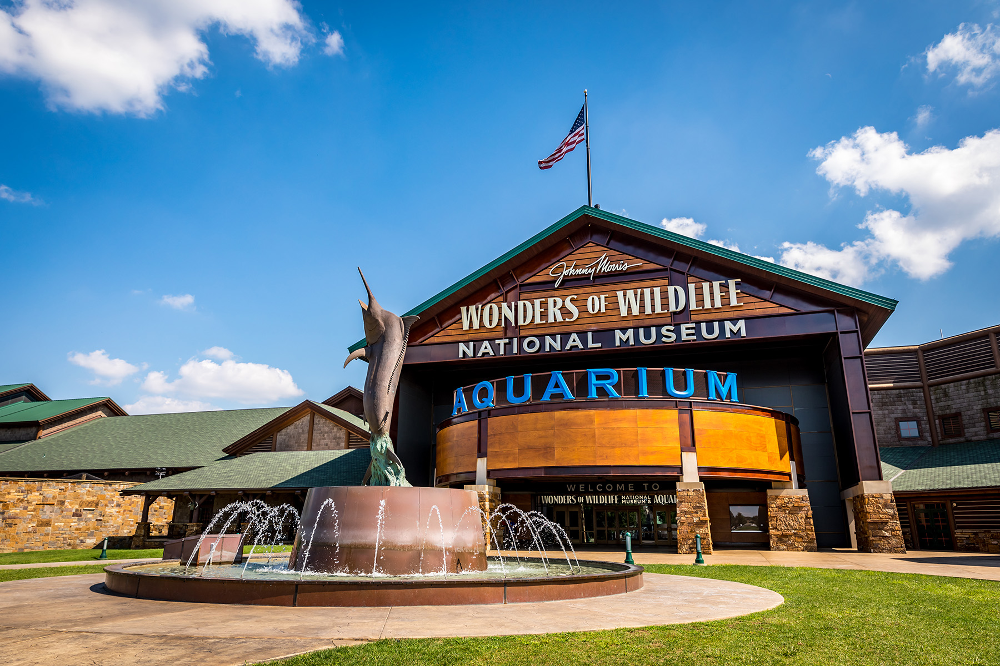
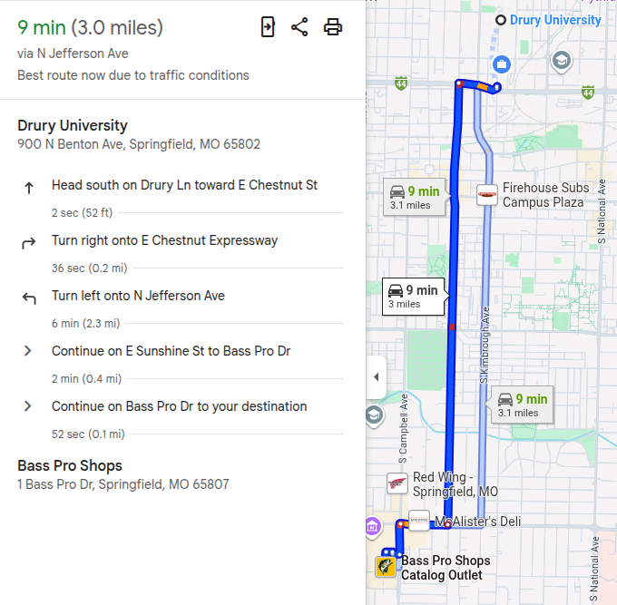

## Today's Agenda {background-image="Images/background-forest_v3.png" .center}

```{r}
library(tidyverse)
library(readxl)
library(kableExtra)
```

<br>

::: {.r-fit-text}

**Section 2: Historical Perspectives on Wilderness**

:::

- Reflecting on the sublime narratives in our markets and politics

<br>

::: r-stack
Justin Leinaweaver (Fall 2026)
:::

::: notes
Prep for Class

1. Review Canvas submissions

2. Have the class circle up seminar style!

3. Bring lots of markers!

<br>

**SLIDE**: Reminder about our next field trip

:::


## Thursday (Sep 17th) {background-image="Images/background-forest_v3.png" .center}

:::: {.columns}

::: {.column width="50%"}

:::

::: {.column width="50%"}

:::

::::

::: notes

Next Thursday we're heading to Bass Pro

<br>

**Does anybody need a ride to get there?**

- Let's be environmental, I will give EC to carpoolers!

<br>

In Section 2 of our class we've begun exploring the competing historical perspectives on wilderness

- **SLIDE**: Last week we traveled to Eden

:::


## {background-image="Images/04_1-Cole_Thomas_Expulsion_from_the_Garden_of_Eden_1828.jpg"}

::: {.r-fit-text}
[**The Edenic Narrative of Wilderness**]{style="color:white;"}
:::

::: {.fragment}

- [**The wilderness is a godless and disorganized place of danger and temptation**]{style="color:white;"}

- [**We must dominate the wilderness (maximally exploit all of its resources)**]{style="color:white;"}

:::

::: notes

**Per our readings last week, what is the wilderness?**

- **How do I know it when I’ve found it?**

<br>

The wilderness is any area beyond human civilization

- It is a place without God full of temptation, suffering and danger

- These wild places are disorganized and crazy-making, places where we lose ourselves and our duty

<br>

**And from the edenic perspective, what is the value of wilderness?**

- (**REVEAL**)

- (Inextricably linked to its service to human needs)

1. Economic exploitation of all its resources, and 

2. Human domination of everything we find out "there"

<br>

**How common is this narrative in our societal discussions of wilderness today?**

- **Give me some current examples!**

<br>

From there, we've shifted to our second perspective on wilderness

- **SLIDE**

:::


## {background-image="Images/04_2-Albert_Bierstadt_-_Valley_of_the_Yosemite_-_Google_Art_Project.jpg"}

::: {.r-fit-text}
[**The Sublime Narrative of Wilderness**]{style="color:white;"}
:::

::: notes

Painting: *Valley of the Yosemite* by Albert Bierstadt completed in 1864

- Bierstadt is one hell of a landscape artist!

<br>

Last class we explored the writings of Henry David Thoreau, John Muir and Thomas Cole as examples of the sublime narrative of wilderness

- Thoreau recounted his climb up Mt Katahdin

- Muir his diary from exploring the Sierra Nevadas

- And Cole making arguments about the importance and value of the American landscape

<br>

**Per those readings, what is the wilderness?**

- **How do I know it when I’ve found it?**

<br>

- The wilderness is a non-human place (alien to our civilization)

- It is a land shaped by natural processes, NOT the hand of man

- Thoreau: 

    - "the unfinished parts of the globe" (29)
    
    - "This was that Earth of which we have heard, made out of Chaos and Old Night. Here was no man’s garden, but the unhandseled globe. It was not lawn, nor pasture, nor mead, nor woodland, nor lea, nor arable, nor waste land. It was the fresh and natural surface of the planet Earth, as it was made forever and ever,—to be the dwelling of man, we say,—so Nature made it, and man may use it if he can” (29).

<br>

**Per those readings, what is the value of wilderness?**

- **Why do we need it??**

<br>

- Wilderness is terrifying, but in a good way!

- We enter as pilgrims seeking god (alien to civilization) 

- Thoreau

    - “Some part of the beholder, even some vital part, seems to escape through the loose grating of his ribs as he ascends. He is more lone than you can imagine. There is less of substantial thought and fair understanding in him than in the plains where men inhabit. His reason is dispersed and shadowy, more thin and subtile, like the air. Vast, Titanic, inhuman Nature has got him at disadvantage, caught him alone, and pilfers him of some of his divine faculty. She does not smile on him as in the plains. She seems to say sternly, Why came ye here before your time. This ground is not prepared for you” (28-29).

    - “I stand in awe of my body, this matter to which I am bound has become so strange to me. I fear not spirits, ghosts, of which I am one,—that my body might,—but I fear bodies, I tremble to meet them. What is this Titan that has possession of me? Talk of mysteries! Think of our life in nature,—daily to be shown matter, to come in contact with it,—rocks, trees, wind on our cheeks! the solid earth! the actual world! the common sense! Contact!” (29).
    
    - “The tops of mountains are among the unfinished parts of the globe, whither it is a slight insult to the gods to climb and pry into their secrets, and try their effect on our humanity. Only daring and insolent men, perchance, go there. Simple races, as savages, do not climb mountains,—their tops are sacred and mysterious tracts never visited by them. Pomola is always angry with those who climb to the summit of Ktaadn” (29).

<br>

**SLIDE**: In sum

:::


## {background-image="Images/04_2-Albert_Bierstadt_-_Valley_of_the_Yosemite_-_Google_Art_Project.jpg"}

::: {.r-fit-text}
[**The Sublime Narrative of Wilderness**]{style="color:white;"}
:::

- [The wilderness is a place we enter as pilgrims seeking connection with something beyond ourselves]{style="color:white;"}

- [Its value is linked to its purity (e.g. absence of our interference)]{style="color:white;"}

::: notes

- Wilderness is terrifying, but in a good way!

- The value of wilderness is in its alien / non-human nature

- We enter it as pilgrims ready to be dominated and awestruck

<br>

**Make sense?**

<br>

For today I asked each of you to head out into the world to find us current examples of the sublime narrative in action!

- **SLIDE**: Let's start with the consumer experiences you found

:::


## {background-image="Images/background-forest_v3.png" .center}

::: {.r-fit-text}
**The Sublime Narrative of Wilderness**
:::

<br>

Find a product, service or experience for sale in our community that represents the sublime narrative in action

::: {.incremental}

1. What did you find?

2. Why is this connected to the sublime narrative?

3. Do you believe it is a sincere expression of the sublime or marketing?

:::

::: notes

**REVEAL**: In a moment we'll go around the room to here what you found

- **REVEAL**: I also want you to make the argument explicit

- **REVEAL**: AND, I want you to evaluate the product or service

<br>

**Make sense?**

- Alright, let's go!

- No computers, let's all discuss what we've found

<br>

**SLIDE**: Reflections on the consumer side

<br>

Canvas DISCUSSION: Reflecting on the Sublime Narratives Around Us - Targeted at Consumers (3 pts)

Find a product, service or experience for sale in our community today that is designed to help us enjoy the wilderness or nature in its most "pristine" condition. No overlapping cases (first-come, first-served).

Submit: 

1. A web link to the product/service/experience, and 
2. An explanation of HOW the marketing for this item connects it to the sublime narratives we explored last class (3+ sentences).

:::


## {background-image="Images/background-forest_v3.png" .center}

### If you wanted to sell the most of a new product or service are you better off framing it as sublime or Edenic in our marketplace today?

::: notes

*DISCUSS*

<br>

**SLIDE**: Let's jump to the politics!

:::


## {background-image="Images/background-forest_v3.png" .center}

::: {.r-fit-text}
**The Sublime Narrative of Wilderness**
:::

<br>

Find a recent example of someone arguing that we should preserve some specific piece of wilderness or nature in order to maximize its value.

::: {.fragment}

- What are the strongest reasons to preserve wilderness in your submission?

:::

::: notes

Everybody start by reflecting on the argument you submitted to canvas

- **REVEAL**: Focus on what you submitted and make a list of the strongest reasons to preserve wilderness in your submission

- Go!

<br>

Ok, grab a marker and let's get all these reasons on the board!

<br>

*DISCUSS*

- **What do you find strongest from all the submissions on the board? Why**

<br>

**SLIDE**: Next class

<br>

Canvas DISCUSSION: Reflecting on the Sublime Narratives Around Us - Targeted at Citizens

Find a recent example of someone arguing that we should preserve some specific piece of wilderness or nature in order to maximize its value. No overlapping cases (first-come, first-served).

Submit: 

1. A link to the argument, 
2. A brief summary of the argument (2+ sentences), and 
3. An explanation of HOW this argument connects it to the sublime narratives we explored last class (3+ sentences).

:::


## For Next Class {background-image="Images/background-forest_v3.png" .center}

<br>

### Utility Narratives of Wilderness

1. Read the excerpts from Pinchot, Spirn, and the USDA team

2. Submit your reflection on these ideas and how they apply to the world around us


::: notes

Next week we shift to our next historical perspective on wilderness

- These writers dramatically altered the course of the US in terms of our wildlife and wilderness management policies


<br>

**Questions on the assignment?**

:::