## Today's Agenda {background-image="Images/background-forest_v3.png" .center}

```{r}
library(tidyverse)
library(readxl)
library(kableExtra)
```

<br>

::: {.r-fit-text}

**Section 2: Historical Perspectives on Wilderness**

- Utility Narratives: Wilderness as a Managed Resource

:::

<br>

::: r-stack
Justin Leinaweaver (Fall 2026)
:::

::: notes
Prep for Class

1. Review Canvas submissions

2. Circle up the class for seminar style talk!

3. MAKE SURE to give them time to discuss each question with the people next to them BEFORE reporting back to you! They need this to get comfortable sharing in a seminar

<br>

Paper feedback was released last Friday

- Let's set the R&Rs due date for this Friday (Sep 18th)!

- Please don't hesitate to come see me if you are confused by the feedback

<br>

**SLIDE**: Field trip reminder

:::


## Thursday (Sep 17th) {background-image="Images/background-forest_v3.png" .center}

:::: {.columns}

::: {.column width="50%"}

:::

::: {.column width="50%"}

:::

::::

::: notes

Thursday we will meet at Bass Pro inside the front entrance to the aquarium at noon


<br>

**Does anybody need a ride to get there?**

- Let's be environmental, I will give EC to carpoolers!

<br>

**SLIDE**: Let's run through our big ideas so far!

:::


## {background-image="Images/background-forest_v3.png" .center}

::: {.r-fit-text}
**A Spectrum of Environments (Nash 2014)**
:::

<br>

```{r, fig.align = 'center', fig.width = 6, fig.height=1.25}
## Manual DAG
d1 <- tibble(
  x = c(-3, 3),
  y = c(1, 1),
  labels = c("Purely\nCivilized", "Purely\nWild")
)

ggplot(data = d1, aes(x = x, y = y)) +
  geom_point(size = 0) +
  theme_void() +
  coord_cartesian(xlim = c(-4, 4)) +
  geom_label(aes(label = labels), size = 7) +
  annotate("segment", x = -1.9, xend = 1.9, y = 1, yend = 1, arrow = arrow(ends = "both"))
```

::: notes

**One more time, according to Nash, what is the wilderness?**

- (The wilderness is a quality of something, not a concrete thing to be identified)

<br>

**And what does that mean for us as community problem-solvers interested in environmental issues?**

- (We have a duty to the natural in all our environments!)

- (**SLIDE**)

:::


## {background-image="Images/background-forest_v3.png" .center}

::: {.r-fit-text}
**We have a duty to foster and protect wildness all around us (Cronon 1996)**
:::

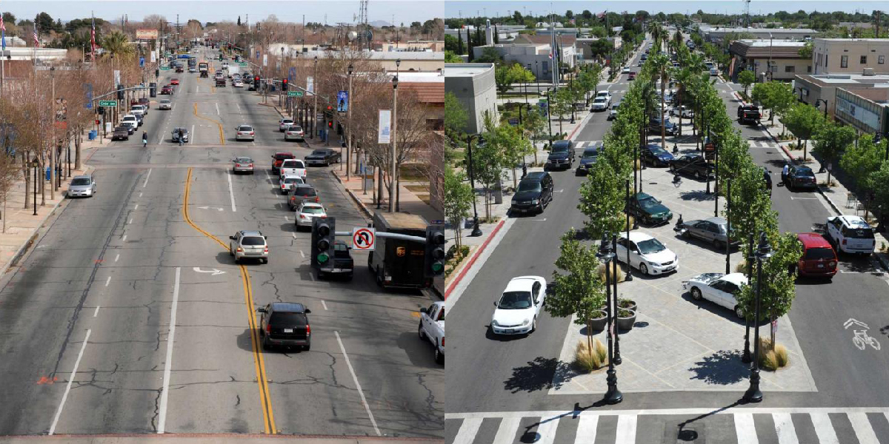{style="display: block; margin: 0 auto"}

::: notes

We have an important role to play in ALL of our environments

- Not just the ones far from civilization!

<br>

Here we see a before-and-after transformation of Main Street in Lancaster, CA [LINK](https://www.pps.org/article/road-diet-reinvigorating-downtown-lancaster-one-lane-at-a-time)

- In policy terms this is often referred to as "putting your road on a diet"

- Before: 2009

- After: 2011

<br>

Supporting the speed limit with street design transformed Main Street into Lancaster Boulevard, a safer public space, bursting with economic, social, and civic vitality.

- Pedestrian involved collisions have decreased by 78%

- Motor vehicle collisions decreased by 38%

- 57 new businesses have opened on Lancaster BLVD

- Retail sales of increased by 57%

- Revenue from the downtown area has increased 119% from 2007 to 2012

<br>

**SLIDE**: The second section of our class has focused on exploring competing historical perspectives on wilderness

:::


## {background-image="Images/background-forest_v3.png" .center}

::: {.r-fit-text}

**Section 2: Historical Perspectives on Wilderness**

- Edenic Narratives

- Sublime Narratives

- Utility Narratives

- Holistic Narratives

:::

::: {.fragment}
::: {.r-fit-text}
[**The narratives can help you unlock problem-solving!**]{style="color:blue;"}
:::
:::

::: notes

Two weeks ago we began with the Edenic narratives found in the Bible and in the descriptions of wild lands written by early American colonists and explorers.

<br>

Last week we shifted to the romantics like Thoreau, Muir and Cole who see in nature a reflection of the awesome spiritual forces in our world

<br>

**REVEAL**

- As I hope I've made clear enough to you, these are not toy exercises meant to read some old books

- These competing perspectives exist in our world and can be a key to helping you solve real problems in our community.

<br>

Engaging with a community means figuring out which version of the wilderness they hold

- You then either have to frame your efforts in line with that view, OR invest energy in shifting them to a different view...

- The better strategy depends on the problem and the stakeholder you are focusing on.

<br>

In an effort to make us all better problem-solvers, let's now shift to our next historical perspective on wilderness!

- **SLIDE**: Utility narratives of the wilderness

:::


##  Gifford Pinchot (1865-1946) {background-image="Images/background-forest_v3.png" .center}

{style="display: block; margin: 0 auto"}

::: notes

[National Park Service Page](https://www.nps.gov/articles/gifford-pinchot.htm)

[Forest History Society Page](https://foresthistory.org/research-explore/us-forest-service-history/people/chiefs/gifford-pinchot-1865-1946/)

<br>

Gifford Pinchot, born in 1865 and died in 1946, is one of the most important early voices in American environmentalism

- Family fortune built, at least in part, on forest resources and so his lifelong interest in forests was fostered from a young age.

- His dad sent him to France to study forestry because the US had no schools of forestry at the time

<br>

Long list of accomplishments

- Helps start the Yale School of Forestry (money, money, money)

- Founds the American Society of Foresters in 1900 "to increase awareness of forestry and provide professional development opportunities for those interested in making a career of protecting woodlands."

- Was appointed the first chief of the US Forest Service in 1905 by Teddy Roosevelt

- Briefly led the National Conservation Commission (1910) performing studies on the resources of the US

- Elected governor of Pennsylvania in 1922

<br>

Also, a long list of clashes with other environmental activists of the time

- He and Muir butted heads A LOT, and I think our discussions today will suggest precisely why that would be.

<br>

**SLIDE**: Prompt

:::


## {background-image="Images/05_1-Gifford-Pinchot-NF_Mt.-Adams_Tom-Hilton.jpg" .center}

::: notes

Gifford Pinchot National Forest is a National Forest located in southern Washington

- 1.32 million acres

- Formerly part of the Mount Rainier Forest Reserve set aside in 1897

- Rededicated to Pinchot three years after his death

<br>

**Anybody visited it?**

<br>

**SLIDE**: Ok, let's talk about Pinchot's "Fight"

:::


## {background-image="Images/05_1-Pinchot_National_Forest2.png" .center}

::: {.r-fit-text}

Pinchot, G. (1910). *The Fight for Conservation*.

- Chapters I, IV, VII, and XII

:::

::: notes

Ok, let's explore Pinchot's views of the wilderness

<br>

**What is the thesis of Chapter 1?**

- **What is Pinchot trying to convince you of by discussing "Prosperity"?**

- (America is rich today because of its resources, but if we don't conserve them for the future we will be ruined)

<br>

**Find me quotes in chapter 1 that struck you as important!**

- "We shall reach a population of two hundred millions in the very near future, as time is counted in the lives of nations, and there is nothing more certain than that this country of ours will some day support double or triple or five times that number of prosperous people if only we can bring ourselves so to handle our natural resources in the present as not to lay an embargo on the prosperous growth of the future."

- "We are accustomed, and rightly accustomed, to take pride in the vigorous and healthful growth of the United States, and in its vast promise for the future. Yet we are making no preparation to realize what we so easily foresee and glibly predict. The vast possibilities of our great future will become realities only if we make ourselves, in a sense, responsible for that future. The planned and orderly development and conservation of our natural resources is the first duty of the United States. It is the only form of insurance that will certainly protect us against the disasters that lack of foresight has in the past repeatedly brought down on nations since passed away."

<br>

**What is the thesis of Chapter 4 ("PRINCIPLES OF CONSERVATION")?**

- ("Conservation means the greatest good to the greatest number for the longest time.")

<br>

**Find me quotes in the chapter that struck you as important!**

- **What are the principles of conservation?**

- "The first principle of conservation is development, the use of the natural resources now existing on this continent for the benefit of the people who live here now."

- "The development of our natural resources and the fullest use of them for the present generation is the first duty of this generation."

- "In the second place conservation stands for the prevention of waste."

- "In addition to the principles of development and preservation of our resources there is a third principle. It is this: The natural resources must be developed and preserved for the benefit of the many, and not merely for the profit of a few."

<br>

**What is the thesis of Chapter 7 ("THE MORAL ISSUE")?**

- ("Conservation is the most democratic movement this country has known for a generation. It holds that the people have not only the right, but the duty to control the use of the natural resources, which are the great sources of prosperity. And it regards the absorption of these resources by the special interests, unless their operations are under effective public control, as a moral wrong.")

<br>

**What is the thesis of Chapter 12 ("THE PRESENT BATTLE")?**

- ("The conservation issue is a moral issue, and the heart of it is this: For whose benefit shall our natural resources be conserved—for the benefit of us all, or for the use and profit of the few?")

<br>

**Find me quotes in the chapter that struck you as important!**

- "Who is to blame because representatives of the people are so commonly led to betray their trust? We all are—we who have not taken the trouble to resent and put an end to the knavery we knew was going on. The brand of politics served out to us by the professional politician has long been composed largely of hot meals for the interests and hot air for the people, and we have all known it."

- "It is a greater thing to be a good citizen than to be a good Republican or a good Democrat."

- "The overshadowing question before the American people to-day is this: Shall the Nation govern itself or shall the interests run this country? The one great political demand, underlying all others, giving meaning to all others, is this: The special interests must get out of politics."

<br>

**How well would these arguments fit when discussing our politics today?**

- **Would Pinchot be happy with where we are now or not?**

<br>

**So, based on these writings why do we think Pinchot and Muir fought over environmental protection?**

- (Conservation meaning use for the benefit of humans today vs preservation of the sublime from human use and abuse)

- (Pinchot using the romantic and sublime language to justify greater use!)

<br>

**SLIDE**: Let's jump to our next reading

:::


## {background-image="Images/background-forest_v3.png" .center}

:::: {.columns}
::: {.column width="50%"}

Spirn, A. (1996). "Constructing Nature: The Legacy of Frederick Law Olmstead." *Uncommon Ground*.

<br>

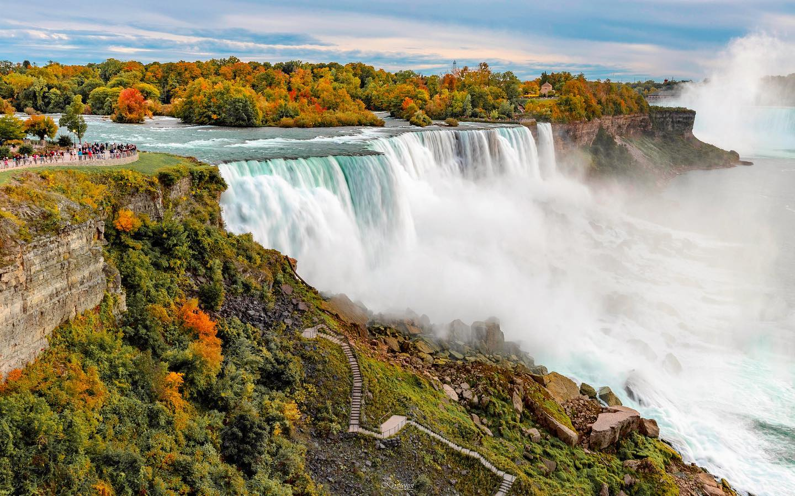

:::

::: {.column width="50%"}

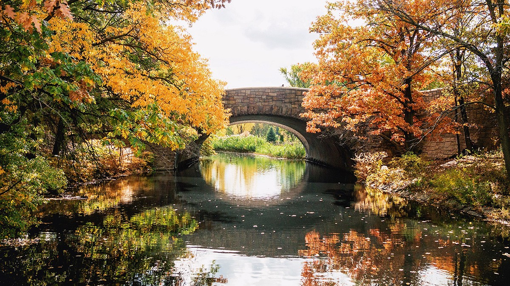

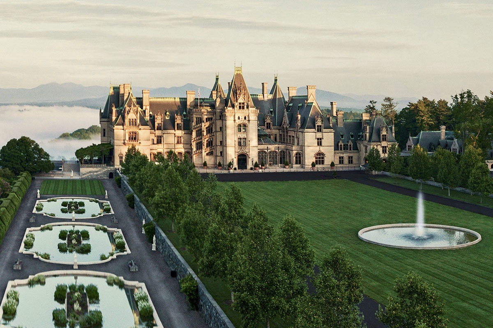

:::
::::

::: notes

*Images: Niagara Falls, Boston Fens, Biltmore Estate*

<br>

Ok, let's now talk about the Ann Spirn chapter on the legacy of Frederick Law Olmsted

- Any surprises in there for you? Did you know all of these astounding places were human constructs?

<br>

**What do we learn about Olmstead and his views of wilderness from his work on Yosemite?**

- **Find me cool quotes!**

- "His view was frankly anthropocentric: Yosemite should be preserved because it had value for humans; to be in a place surrounded by "natural scenery" promoted human health and welfare. Such scenery, he felt, should never be private property, but should be held in trust for public purposes, for its importance to the nation was comparable to strategic, defensive points along national boundaries" (92). 

- "Olmsted's proposals for Yosemite were deceptively simple: provide free access for all visitors in a manner that preserved the valleys scenic qualities" (93). 

- "To Olmsted the significance of Yosemite lay in the quality of its scenery--"the union of the deepest sublimity with the deepest beauty of nature"--not in any one scene or series of views, but in the whole. Although he noted the economic significance of such scenery, it's benefit to public health and welfare concerned him most intensely" (93).

- "Ironically, Olmsted's concealment of the artifice of his intervention (a tradition continued today in the national parks) permits the misconception that places like Yosemite are not designed and managed" (95).

<br>

**According to Spirn, what is the powerful lesson of Olmstead's work on the Biltmore Forest?**

- ("The powerful lesson of Biltmore is what human impulse can accomplish given sufficient time, with an eye to Restoration and beauty, as well as to utility. 100 years ago there was no Forest at biltmore, just cut over woods and infertile fields. Now there is forest. Olmsted had the designers faith that he could make something better, not worse. Key to his belief in himself was the ability to envision the future shape of the landscape, to guide it over time, and to imagine human intervention as potentially beneficial, not inevitably detrimental. He aimed to demonstrate how human intervention could make a forest more beautiful and more productive, provided one pursued long-term goals and a gradual return on investment, rather than short-term gain and maximum profit" (102).)

<br>

**Why does Spirn tell us Olmstead's legacy is "double-edged"?**

- (He was so good at making his work look natural that he'd run into objections from people when he tried to continue working on it)

- (e.g. don't you dare sully that pristine wilderness that you just built for us...)

- "On the other, he disguised the artifice, so that ultimately the built landscapes were not recognized and valued as human constructs. He planted trees to look like "natural scenery" and then fel frustrated when people, accepting the scenery as "natural," objected to cutting the trees he had planned to cull" (111)

<br>

Spirn does an excellent job presenting Olmstead as the halfway point on wilderness between Muir's preservation and Pinchot's workshop. 

- An attempt to "reconcile reverence and use" (112)

<br>

Importantly to me, Olmstead reinforces our key idea!

- Seeing some landscapes as natural and others as artificial is a serious problem

- We have to let go of the natural vs artificial distinction and instead celebrate the wild in all its forms!

<br>

**SLIDE**: Last of the readings

:::


## {background-image="Images/background-forest_v3.png" .center}

:::: {.columns}

::: {.column width="60%"}

<br>

<br>


Hendee, J., Stankey, G. & Lucas, R. (1978). *Wilderness Management*. US Department of Agriculture.
:::

::: {.column width="40%"}
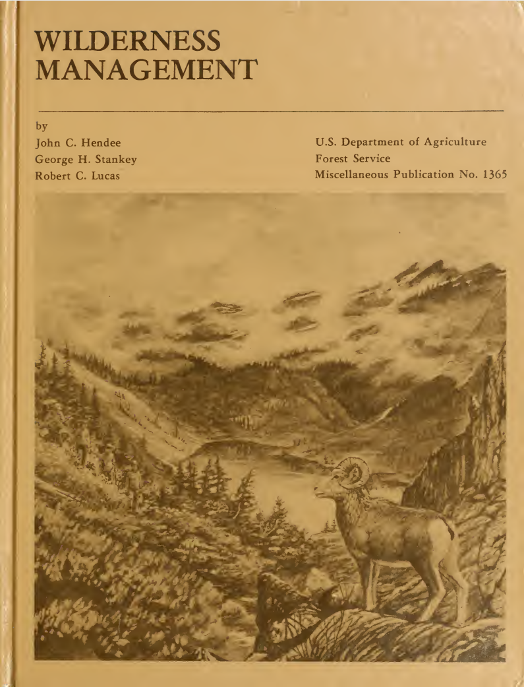
:::

::::

::: notes

I really appreciate the USDA book tries diligently to translate the broad principles advocated by Pinchot and others into more concrete guidance for decision-making.

<br>

Let's begin by treating this like the other sources we have considered.

- **How do these authors define the wilderness?**

- (**SLIDE**: They work for the USDA so the law takes care of this for them!)

:::


## Wilderness Act (1964) 2(c){background-image="Images/background-forest_v3.png" .center}

<br>

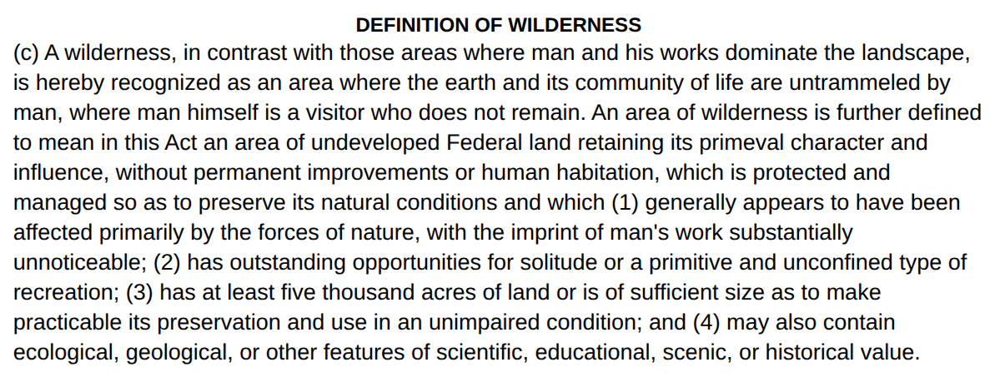{style="display: block; margin: 0 auto"}

::: notes

Given everything we've read and discussed so far this semester, I'd like your reflections on this definition.

- Take a moment to discuss this definition with the people around you and get ready to report back:

- **What do you like about this definition?**

- **What problems do you have with it?**

<br>

Before we dig into the principles, I want your thoughts on the paradox they discuss on p6

- **FIRST, what is the paradox?**

- (If a wilderness is an area with minimal human interference, then how can wilderness management be a thing? The minute you manage "it" you destroy "it", right?)

<br>

**And how do they sidestep the paradox?**

- ("Wilderness management is essentially the management of human use and influence to preserve naturalness and solitude" (6).)

- "Wilderness management does not need to be heavy handed. Wilderness managers are, in effect, guardians and not gardeners" (7).

- "Managers should do only what is necessary to meet wilderness objectives, and only use the minimum tools, force, and regulation required to achieve those objectives" (7).

<br>

Do we buy this?

- **SLIDE**: Let's evaluate the principles of management to see what happens when the proverbial rubber meets the road!

:::


## {background-image="Images/05_1-Pinchot_National_Forest2.png" .center}

Hendee, J., Stankey, G. & Lucas, R. (1978). *Wilderness Management*. US Department of Agriculture.

- "Some Principles of Wilderness Management" (137-147)

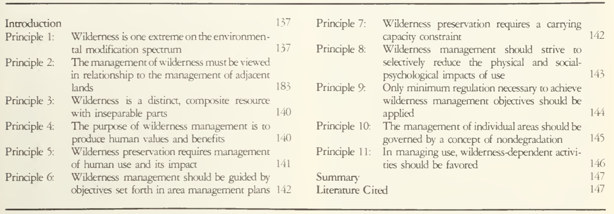

::: notes

**Do these principles live up to the authors' earlier claims about wilderness management being a minimalist exercise? Why or why not?**

<br>

**Which of the principles are the clearest / easiest to adopt and follow in our comunities? Why?**

<br>

**Which of the principles would be the hardest to follow or would inspire the most opposition? Why?**

<br>

- **How would advocates of the Edenic perspective react to these principles?**

- **How would advocates of the sublime perspective react to these principles?**

<br>

**Bottom line, do we think this list of principles represents a useful set of criteria for managing wild spaces in our communities? Why or why not?**

<br>

**SLIDE**: Sum this up for me

:::


## {background-image="Images/05_1-Chimney_Rocks_Cherokee_National_Forest.jpg"}

::: {.r-fit-text}
[**The Utility Narrative of Wilderness**]{style="color:blue;"}
:::

::: {.fragment}
- [**Defines wilderness in rather sublime terms, but...**]{style="color:blue;"}


- [**Sees value in its sustainable use to improve human lives in the immediate term**]{style="color:blue;"}
:::

::: notes

**Based on our readings and discussion today, what is the wilderness from the perspective of the utility narrative?**

- (*See where they landed on this*)

<br>

This is a tough thing to narrow down from these readings...

- Wilderness Act (1964) 2(c): Areas where the earth and its community of life are untrammeled by man... Man is a visitor who does not remain...

<br>

**And what is the value of wilderness from the perspective of the utility narrative?**

- (**REVEAL**: Wilderness is a resource to improve lives but it must be managed so we don’t run out)

<br>

For me, one of the key complexities of this approach to the wilderness is that it can be used to justify "uses" that are staggeringly inconsistent

- **SLIDE**

:::


## {background-image="Images/05_1-central_park.jpg"}

::: {.r-fit-text}
[**The Utility Narrative of Wilderness**]{style="color:white;"}
:::

::: notes

Conservationists working from a utility perspective have given us incredible environments designed to be enjoyed

<br>

**SLIDE**: But seemingly more often use looks quite different...

:::


## {background-image="Images/05_1-TongasClearCut.webp"}

::: {.r-fit-text}
[**The Utility Narrative of Wilderness**]{style="color:white;"}
:::

::: notes

**SLIDE**: Back to the nature center!

:::


## {background-image="Images/background-forest_v3.png" .center}

### Using the utility perspective on wilderness rate the SGF Conservation Nature Center on a scale from 0 (purely civilized) to 10 (purely wild)?

```{r, fig.align = 'center', fig.width = 6, fig.height=1.25}
## Manual DAG
d1 <- tibble(
  x = c(-3, 3),
  y = c(1, 1),
  labels = c("Purely\nCivilized", "Purely\nWild")
)

ggplot(data = d1, aes(x = x, y = y)) +
  geom_point(size = 0) +
  theme_void() +
  coord_cartesian(xlim = c(-4, 4)) +
  geom_label(aes(label = labels), size = 7) +
  annotate("segment", x = -1.9, xend = 1.9, y = 1, yend = 1, arrow = arrow(ends = "both"))
```

::: notes

Alright, let's report back on your answers to Canvas Q1!

- **Per the utility narrative on wilderness is the Springfield Conservation Nature Center an example of the wild, civilization or somewhere in between?**

<br>

**Per the utility narrative on wilderness, is the Springfield Conservation Nature Center a "good" use of our environment?**

<br>

**SLIDE**: For next class

:::


## For Next Class {background-image="Images/background-forest_v3.png" .center}

:::: {.columns}

::: {.column width="50%"}

:::

::: {.column width="50%"}

:::

::::

::: notes

Alright class, let's get back out into the world!

- Thursday we will meet at Bass Pro inside the front entrance to the aquarium at noon

<br>

I want us to explore Bass Pro using our three narratives

- Is Bass Pro selling and celebrating a wilderness best described as Edenic, sublime or utilitarian?

<br>

**Does anybody need a ride to get there?**

- Let's be environmental, I will give EC to carpoolers!

<br>

See you Thursday inside the front entrance!


:::


## Old slides


## {background-image="Images/background-forest_v3.png" .center}

::: {.r-fit-text}
**Concentrated Animal Feeding Operations (CAFO)**
:::

{style="display: block; margin: 0 auto"}

::: notes

**Has anybody ever heard the acronym CAFO before?**

- **Can you tell us anything you know about concentrated animal feeding operations?**

<br>

Applying factory processes to farming means finding ways to maximize your efficiency

- This puts the focus on reducing costs and increasing production

- CAFOs are a BIG reason why meat at the grocery store has tended to get cheaper and cheaper over time

- Huge benefits to families trying to buy groceries on fixed incomes

<br>

**SLIDE**: In exchange for cheaper food we are being asked to accept some big risks

:::


## CAFO Problem 1 {background-image="Images/background-forest_v3.png" .center}

:::: {.columns}
::: {.column width="60%"}

<br>

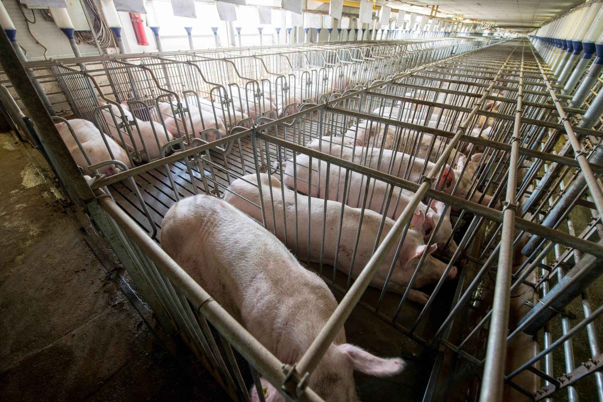
:::

::: {.column width="40%"}
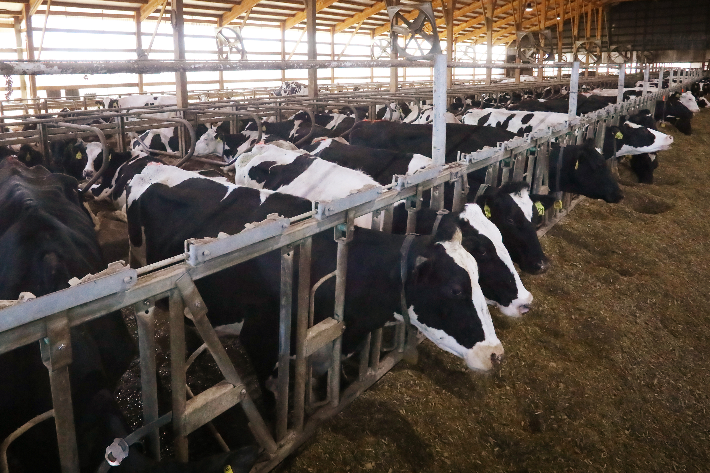

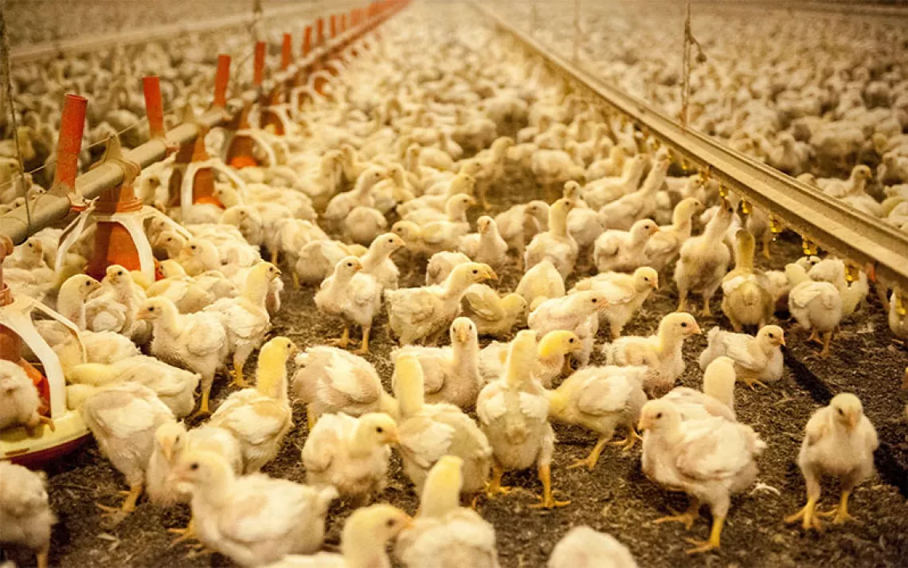
:::
::::

::: notes

FIRST, many object to the treatment of animals like this on ethical terms

- The animals are typically given very little space to move 

- The feeding is constant

- There is no opportunity for exercise

<br>

**SLIDE**: Second

:::


## CAFO Problem 2 {background-image="Images/background-forest_v3.png" .center}

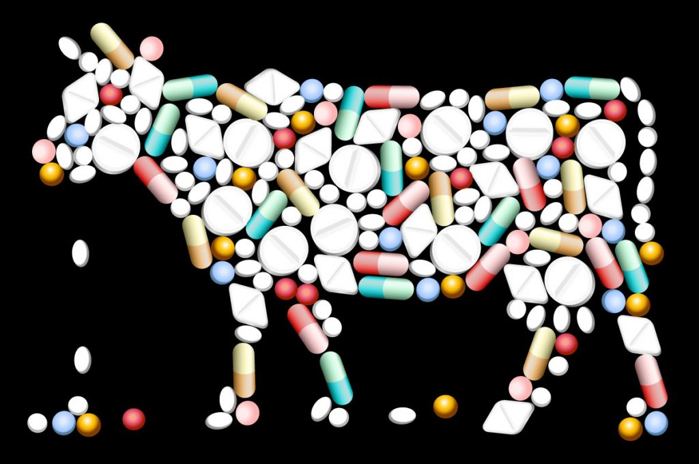{style="display: block; margin: 0 auto"}

::: notes

SECOND, maintaining a massive animal population in close quarters means diseases spread easily and rapidly

- SO, most CAFOs use subtherapeutic dosing

- This means routine, low-dose antibiotic use in all of the animals

- Giving low doses of antibiotics to healthy animals kills weak bacteria but allows resilient strains to survive and multiply

- HENCE, on a MASSIVE scale these CAFOs are breeding bacteria that are resistant to antibiotics

<br>

The impacts are massive

- The WHO estimates that in 2021 antimicrobial resistance (AMR) was associated with more than 4.7 million deaths globally

- In the US the CDC estimates more than 2.8 million antimicrobial-resistant infections occur each year

- And the numbers are increasing rapidly.

<br>

**SLIDE**: Problem 3

:::


## CAFO Problem 3 {background-image="Images/background-forest_v3.png" .center}

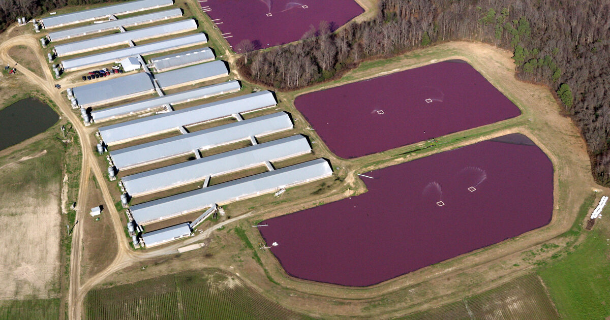{style="display: block; margin: 0 auto"}

::: notes

THIRD, CAFOS generate millions of tons of manure every year. 

- The most common type of facility to deal with this waste is an anaerobic lagoon e.g. a giant lake of poop

- When properly managed these lagoons represent a substantial risk to the environment and public health

- They threaten groundwater, local ecosystems and damage the air quality above them

<br>

**SLIDE**: And when things go wrong...

:::


## {background-image="Images/background-forest_v3.png" .center}

:::: {.columns}
::: {.column width="60%"}
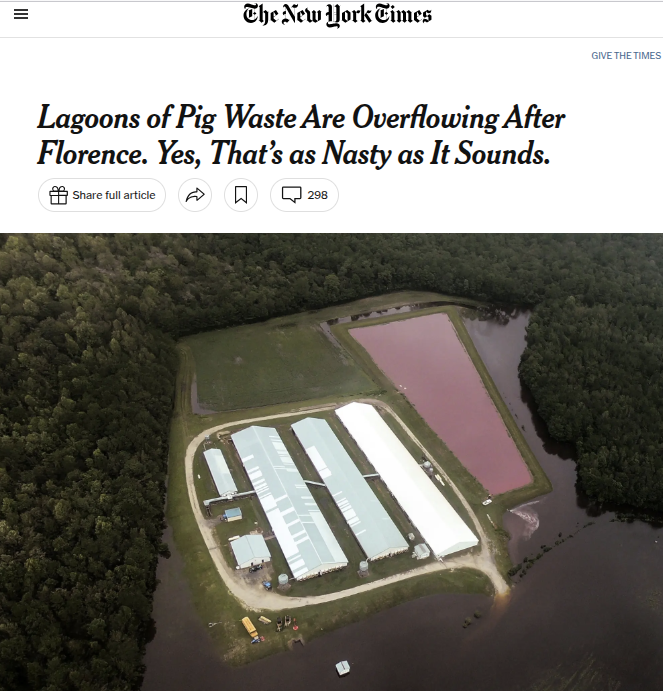
:::

::: {.column width="40%"}
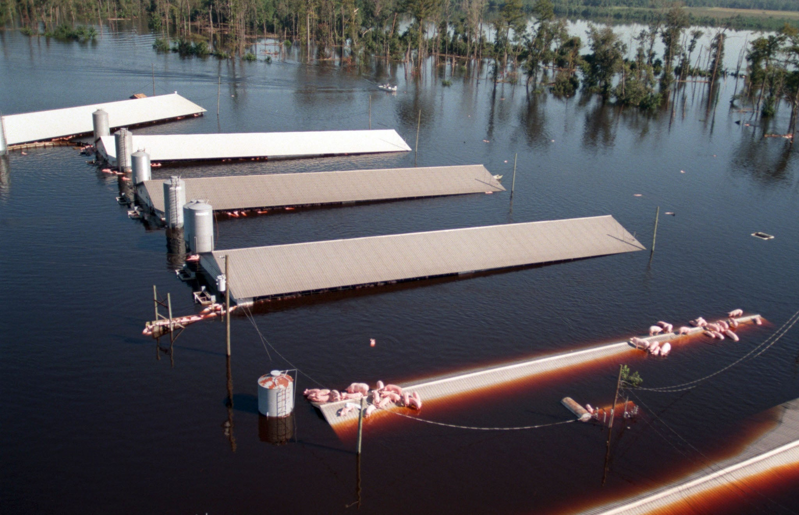

<br>

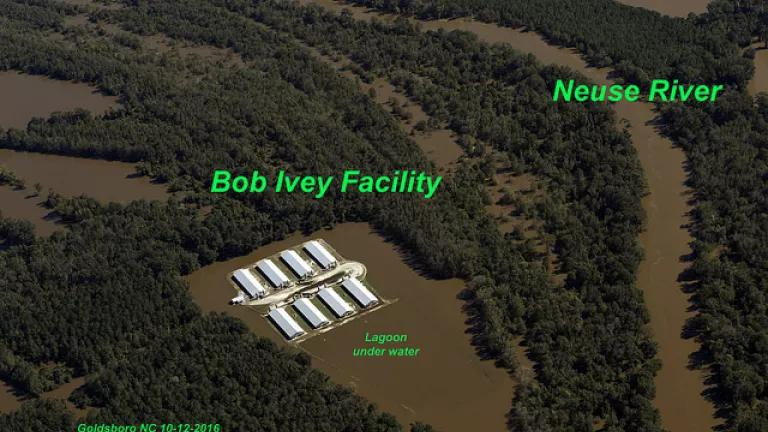
:::
::::

::: notes

When not maintained well OR when flooding rains hit they do INCREDIBLE damage to our ecosystems!

<br>

Does anybody think flooding rain is an unusual event in rural farm communities?

<br>

**SLIDE**: So, there are some substantial reasons to oppose the spread of CAFOs in our communities...

:::


## {background-image="Images/background-forest_v3.png" .center}

::: {.r-fit-text}
**Concentrated Animal Feeding Operations (CAFO)**
:::

{style="display: block; margin: 0 auto"}

::: notes

**Thinking back to our narratives, is it more likely that the owner of a CAFO holds an Edenic or sublime perspective on nature?**

<br>


:::


## Missouri Guardrails {background-image="Images/background-forest_v3.png" .center}

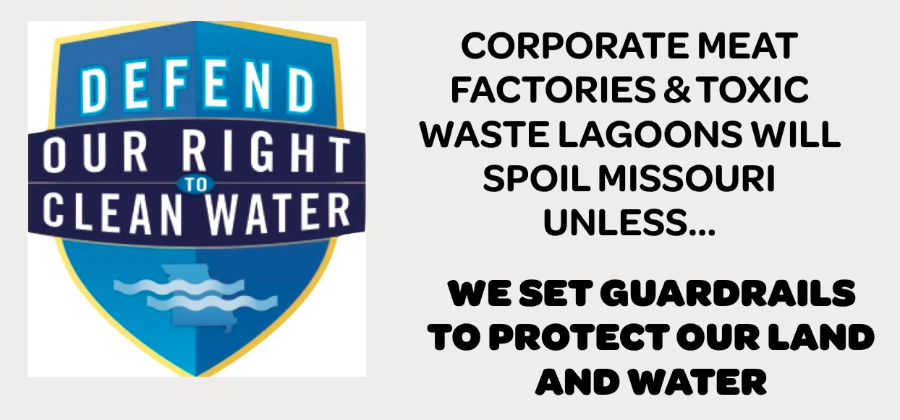{style="display: block; margin: 0 auto"}

::: notes

Missouri Guardrails is a local nonprofit focused on protecting our water and land against uncontrolled waste releases by CAFOS

<br>

The Missouri legislature has passed laws to make regulating CAFO operations almost impossible for local communities

- Missouri Guardrails is trying to push back on this

<br>

Let's say you are trying to convince the owner of a local CAFO to spend money to reduce the harms of their CAFO on the environment

<br>

**What kinds of arguments or explanations might they give you that suggest they hold an Edenic view of the environment?**

<br>

**Given this view, what kinds of arguments can you be confident will NOT work to change this person's behavior?**

<br>

**More importantly, what kinds of arguments might have a chance to change their behavior?**

- **In other words, how do you frame a water protection argument consistent with an Edenic view of wilderness?**

<br>

**SLIDE**: The "about us" page on Missouri Guardrails is pretty good!

:::


##  {background-image="Images/background-forest_v3.png" .center}

:::: {.columns}
::: {.column width="50%"}
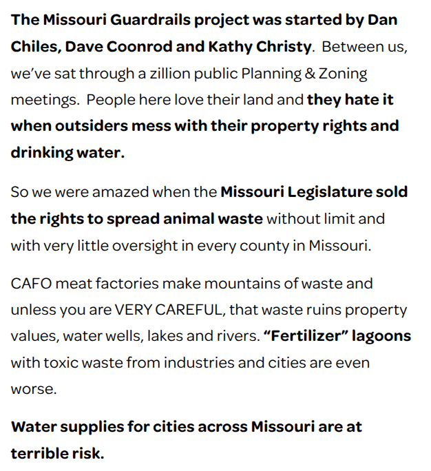
:::

::: {.column width="50%"}
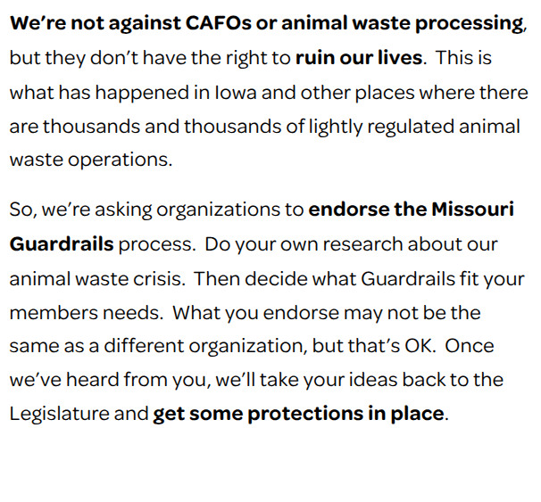
:::
::::

::: notes

So, what do you think?

- **Is this a clever framing strategy for changing the minds or behavior of our hypothetical landowner? Why or why not?**

<br>

This is probably targeted more at landowners near CAFOs and not the CAFOs themselves...

:::


## {background-image="Images/background-forest_v3.png" .center}

::: {.r-fit-text}

[**The narratives can help you unlock problem-solving!**]{style="color:blue;"}

- Edenic Narratives

- Sublime Narratives

- Utility Narratives

- Holistic Narratives

:::

::: notes

The takeaway here is that the narrative perspectives can help you cut to the heart of an argument

<br>

**SLIDE**: Let's not pretend our only challenge are the Edenists!

:::


##  {background-image="Images/background-forest_v3.png" .center}

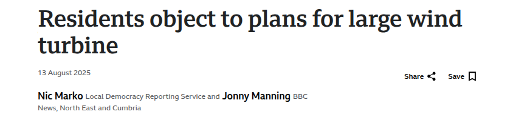{style="display: block; margin: 0 auto"}

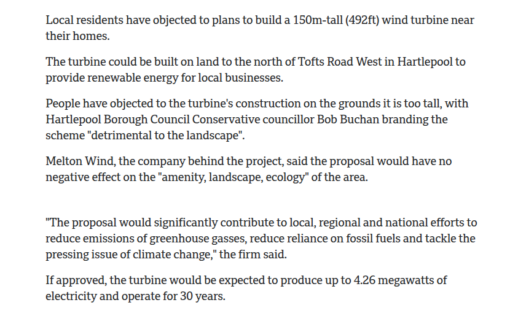{style="display: block; margin: 0 auto"}

::: notes

Imagine you have been working to move your local community to replace its coal fired power plants with wind energy

- And yet every step of the way you are being fought, not by oil or mining intererests, but by homeowners who don't want you messing with their view of the wilderness!

- These homeowners want renewable resources just not in their backyards!

<br>

**Assuming their view of the wilderness is sublime or romantic, what kinds of arguments can you be confident will NOT work to change this person's behavior?**

<br>

**More importantly, what kinds of arguments might have a chance to change their behavior?**

- **In other words, how do you frame a pro-wind turbine argument consistent with a sublime view of wilderness?**

<br>

**Any questions on what we've done so far or why it might be useful in the future?**

:::